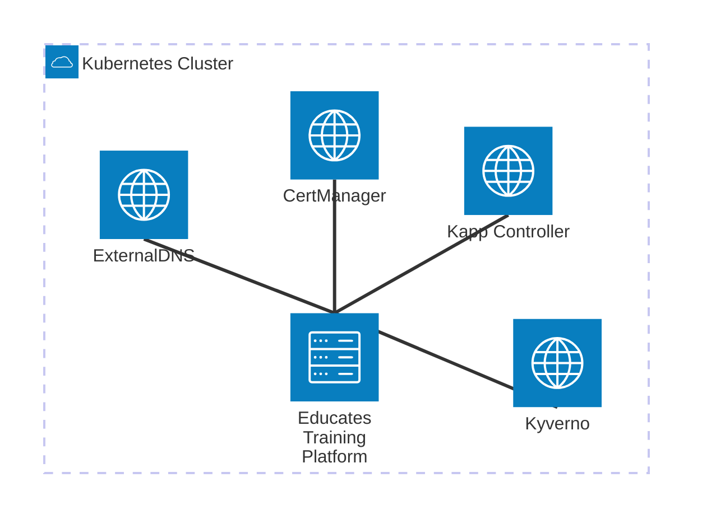

# Deployment

Educates is a Kubernetes-based platform designed to provide interactive workshop environments. This section provides a comprehensive overview of the Educates architecture, its core concepts, and how the system works.

## Deployment Components

The Educates Training Platform has some requirements for it's configuration to properly work on a Kubernetes cluster on a production environment.

These requirements are:

- A **Kubernetes cluster**. Educates has been tested on **GKE**, **EKS** and **AKS**, **Minishift** and **Kind**. 
- A **domain name** so that training portals will be accessible from the internet. In our cloud deployment we use **ExternalDNS** to create the DNS records, but you can use any other DNS provider. On local cloud deployments you can rely on external services like **nip.io** or **xip.io** or use Educates Local Resolver.
- A **wildcard certificate** for the domain name as we want access to the training portals to be secured. You can run Educates Training Platform over **http** but we don't recommend it. For local deployments, Educates CLI helps you manage your own certificates. For cloud deployments, you can use **cert-manager** to issue certificates from Let's Encrypt.
- A **policy engine**. Educates can enforce policies on the cluster and on every workshop session. It can use Kubernetes native policies or external policy engines like **Kyverno**, which is our recommended policy engine and the default one.

**Educates Training Platform** does provide an installation mechanism via it's CLI that will provide oppinionated
deployments of the required components on local clusters, **GKE** and **EKS**. It does installation in an imperative way,
but you can also install Educates declaratively using **kapp-controller**.
