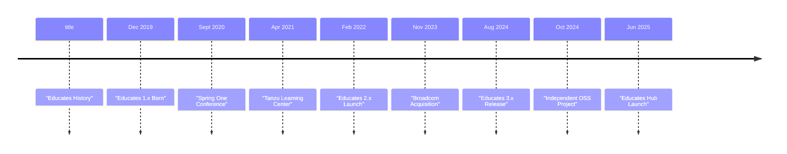

This page documents the evolution of the Educates project from its inception as an internal tool to becoming an independent open-source project.

## Project Timeline

The following timeline shows the major milestones in Educates' history:

## Key Milestones

### December 2019 - Educates 1.x is Born

Educates was originally created as an internal tool for the VMware Tanzu Developer Advocates team. The team needed a platform to train users in Kubernetes and showcase developer tools and applications running on Kubernetes. This initial version laid the foundation for what would become a comprehensive training platform.

**Key Features:**
- Basic workshop hosting capabilities
- Kubernetes-based architecture
- Support for interactive training sessions

### September 2020 - Spring One Conference

Educates proved its scalability and reliability when it was used at the Spring One conference to run **over 5,000 workshop executions**. This large-scale deployment demonstrated that Educates could handle enterprise-level training scenarios and validated the platform's architecture and design decisions.

**Achievements:**
- Successfully scaled to support hundreds of concurrent users
- Validated the platform's reliability and performance
- Demonstrated real-world applicability for large conferences

### April 2021 - Tanzu Learning Center Launch

VMware launched **Tanzu Learning Center** using Educates 1.x as its foundation. This marked Educates' transition from an internal tool to a production platform powering VMware's official learning initiatives. The Learning Center provided structured training paths for VMware Tanzu products and technologies.

**Impact:**
- Educates became a core component of VMware's training infrastructure
- Enabled structured learning paths for Tanzu products
- Expanded the platform's user base significantly

### February 2022 - Educates 2.x Launch

The Developer Advocates team resumed active development on Educates to create version 2.x, which was designed to power multiple learning platforms:
- **[Tanzu.academy](https://tanzu.academy)** - VMware Tanzu training platform
- **[Kube.academy](https://kube.academy)** - Kubernetes training platform
- **[Spring.academy](https://spring.academy)** - Spring framework training platform

**Version 2.x Improvements:**
- Enhanced workshop authoring capabilities
- Improved user experience
- Better integration with learning management systems
- Expanded support for different training scenarios

### November 2023 - Broadcom Acquisition

Broadcom acquired VMware and gained ownership of the Educates project. This transition period involved organizational changes and strategic decisions about the future of the platform. During this time, the project continued to be maintained and used across the various learning platforms.

**Transition Period:**
- Project ownership transferred to Broadcom
- Continued maintenance and support
- Strategic evaluation of project direction

### August 2024 - Educates 3.x Release

Educates 3.x was released with significant improvements focused on usability and deployment:

**Major Enhancements:**
- **Cloud Installers**: Simplified installation process for cloud providers
- **Improved Usability**: Enhanced user experience and workflow
- **Better Documentation**: Comprehensive guides and references
- **Enhanced Features**: New capabilities and integrations

This release marked a significant step forward in making Educates more accessible and easier to deploy.

### October 2024 - Independent Open Source Project

In a significant milestone, Educates was **donated by Broadcom** and became an **independent open-source project**. This transition ensured the project's long-term sustainability and community-driven development.

**Benefits of Independence:**
- Community-driven development and governance
- Open contribution model
- Independent project roadmap
- Broader adoption and ecosystem growth

The project is now maintained by the Educates community, with contributions from developers, users, and organizations worldwide.

### June 2025 - Educates Hub Launch

The **Educates Hub** was launched, providing a centralized platform for:
- Discovering workshops
- Sharing workshop content
- Community collaboration
- Workshop marketplace

**Hub Features:**
- Workshop catalog and discovery
- Community contributions
- Easy workshop sharing
- Integration with Educates deployments

## Evolution Summary

Educates has evolved from a small internal tool to a comprehensive, independent open-source platform:

1. **Internal Tool (2019-2020)**: Created to solve specific needs of the Developer Advocates team
2. **Production Platform (2020-2023)**: Scaled to support enterprise training and multiple learning platforms
3. **Corporate Ownership (2023-2024)**: Maintained under VMware/Broadcom ownership
4. **Independent OSS (2024-present)**: Community-driven open-source project with broad adoption

## Looking Forward

As an independent open-source project, Educates continues to evolve with:
- Active community contributions
- Regular feature releases
- Expanding use cases and adoption
- Growing ecosystem of workshops and integrations

The project's journey from an internal tool to an independent open-source platform demonstrates its value and the commitment of its community to making interactive Kubernetes training accessible to everyone.

