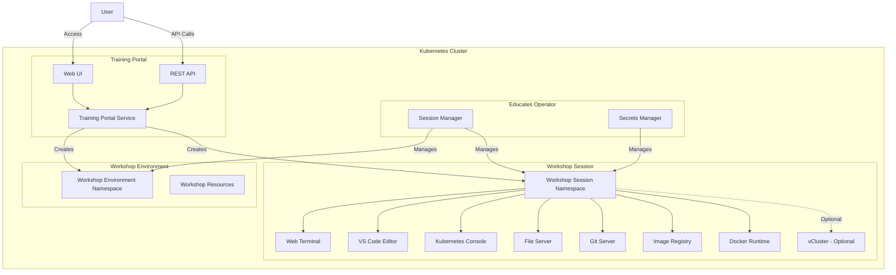
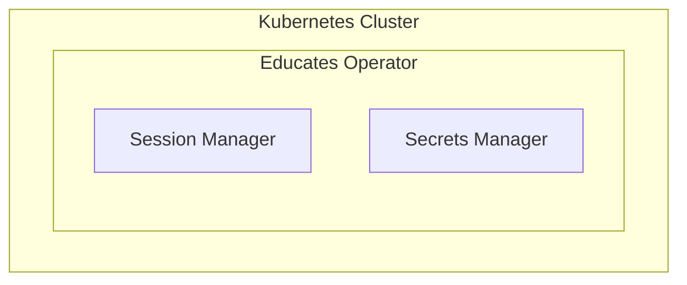
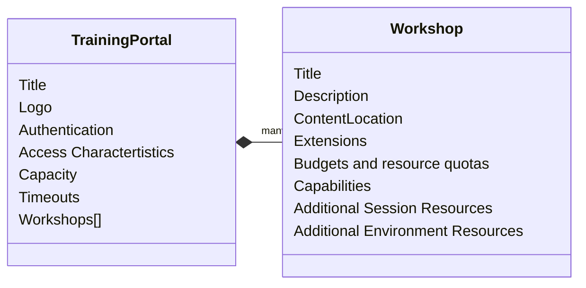
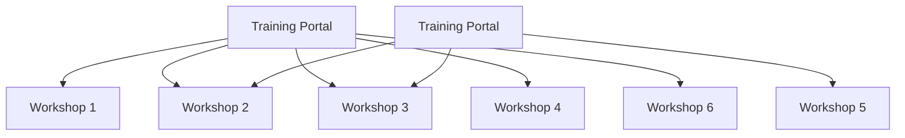

Educates is a Kubernetes-based platform designed to provide interactive workshop environments. This section provides a comprehensive overview of the Educates architecture, its core concepts, and how the system works.

## Architectural Components

The core architecture consists of the **Session Manager**, **Secrets Manager**, which are the main Kubernetes Controllers. These controllers manages a set of **Custom Resource Definitions (CRDs)**, the **Training Portal** and **Workshop**, which are the main Kubernetes Resources a user will deal with. These resources work together to create **Workshop Environments** and **Workshop Sessions**.

## Core Components

### Session Manager

The Session Manager is responsible for:
- Creating and managing workshop session namespaces
- Allocating resources to sessions
- Managing session lifecycle (creation, updates, deletion)
- Ensuring proper RBAC and resource quotas are applied

### Secrets Manager

The Secrets Manager handles:
- Secret management across workshop sessions
- Secret injection into workshop environments
- Secret copying between namespaces
- Secure secret distribution

### Workshop

Provides the definition of a workshop. Preloaded by an administrator into the cluster, it defines where the workshop content is hosted, or the location of a container image which bundles the workshop content and any additional tools required for the workshop. The definition also lists additional resources that should be created which are to be shared between all workshop sessions, or for each session, along with details of resources quotas and access roles required by the workshop.

### Training Portal

Created by an administrator in the cluster to trigger the deployment of a training portal. The training portal can provide access to **one or more** distinct workshops defined by a **Workshop** resource. 

The training portal provides a **web based interface** for registering for workshops and accessing them. 

It also provides a **REST API** for requesting access to workshops, allowing custom front ends to be created which integrate with separate identity providers and which provide an alternate means for browsing and accessing workshops.

## Resource Flow

1. **Workshop Definition**: A `Workshop` resource is created, defining the workshop content and requirements
2. **Training Portal**: A `TrainingPortal` resource is created, which sets up the web interface
3. **Workshop Environment**: The portal creates `WorkshopEnvironment` resources for each workshop
4. **Workshop Session**: When a user requests access, a `WorkshopSession` resource is created
5. **Session Resources**: The operator creates all necessary resources for the session (namespaces, services, etc.)
