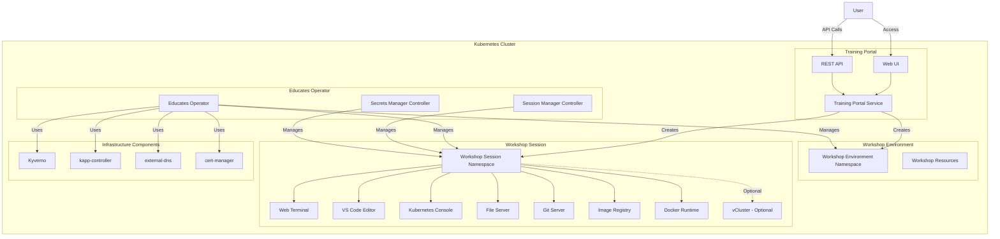

# Architecture

Educates is a Kubernetes-based platform designed to provide interactive workshop environments. This section provides a comprehensive overview of the Educates architecture, its core concepts, and how the system works.

## High-Level Architecture

The Educates platform is built on Kubernetes and uses a controller-based architecture to manage workshop environments and sessions. The following diagram illustrates the high-level architecture:

## Core Components

### Educates Operator

The Educates Operator is the central component that manages the lifecycle of workshops. It watches for Custom Resources (CRs) and ensures the desired state is achieved:

- **Workshop Controller**: Manages `Workshop` resources that define workshop content and configuration
- **Training Portal Controller**: Manages `TrainingPortal` resources that provide the web interface
- **Workshop Environment Controller**: Manages `WorkshopEnvironment` resources for setting up workshop environments
- **Workshop Session Controller**: Manages `WorkshopSession` resources for individual user sessions

### Session Manager Controller

The Session Manager Controller is responsible for:
- Creating and managing workshop session namespaces
- Allocating resources to sessions
- Managing session lifecycle (creation, updates, deletion)
- Ensuring proper RBAC and resource quotas are applied

### Secrets Manager Controller

The Secrets Manager Controller handles:
- Secret management across workshop sessions
- Secret injection into workshop environments
- Secret copying between namespaces
- Secure secret distribution

### Training Portal

The Training Portal provides:
- **Web UI**: A user-friendly interface for browsing and accessing workshops
- **REST API**: Programmatic access to workshop catalog and session management
- **Authentication**: User registration and authentication mechanisms
- **Session Management**: Allocation and management of workshop sessions

## Resource Flow

1. **Workshop Definition**: A `Workshop` resource is created, defining the workshop content and requirements
2. **Training Portal**: A `TrainingPortal` resource is created, which sets up the web interface
3. **Workshop Environment**: The portal creates `WorkshopEnvironment` resources for each workshop
4. **Workshop Session**: When a user requests access, a `WorkshopSession` resource is created
5. **Session Resources**: The operator creates all necessary resources for the session (namespaces, services, etc.)

## Next Steps

- Learn about [Core Concepts](./concepts.md) to understand the building blocks of Educates
- Explore [Workflows](./workflows.md) to see how Educates operates in practice
- Discover the [History](./history.md) of Educates and its evolution
- Check out the [Getting Started Guides](/getting-started-guides) for hands-on tutorials

