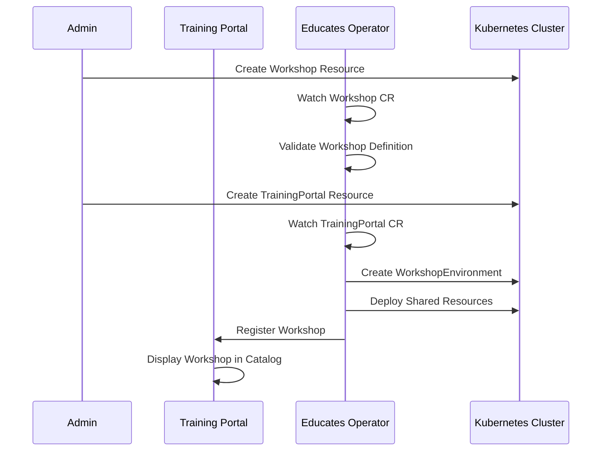
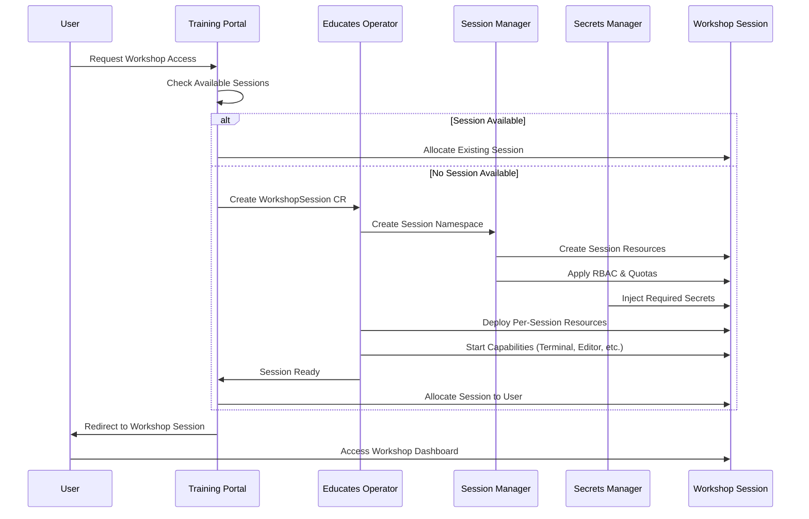
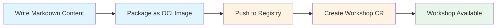
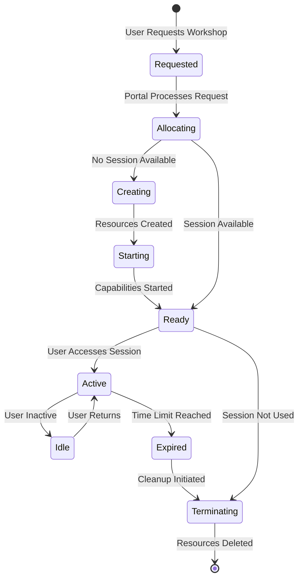
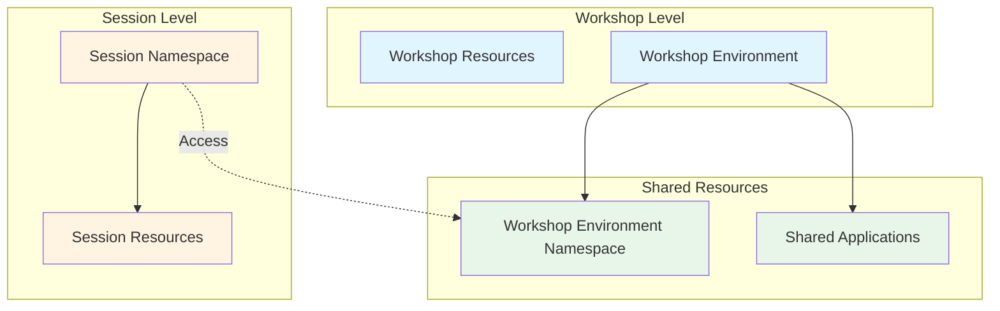
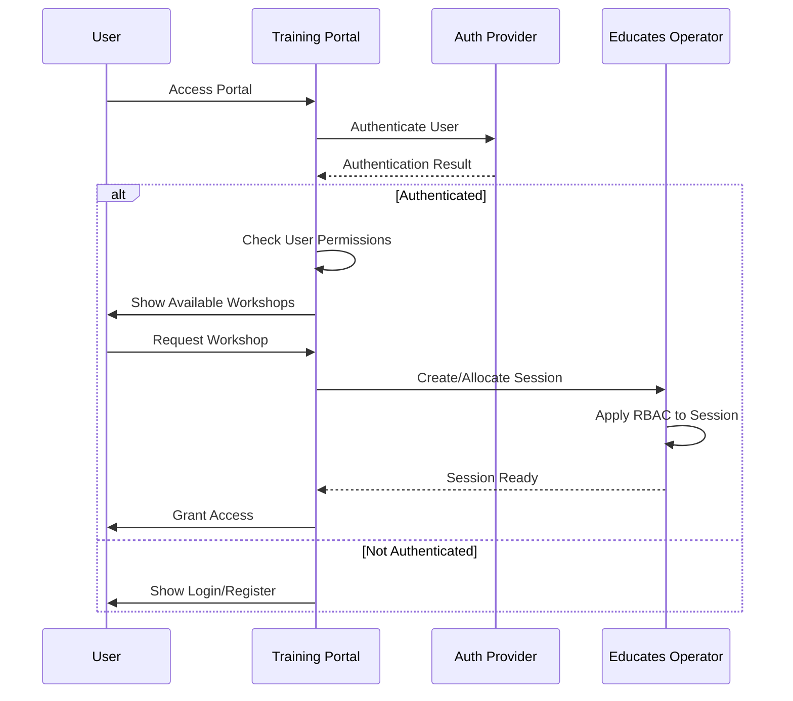
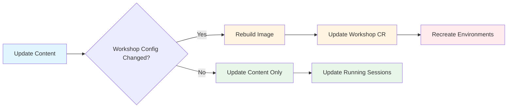
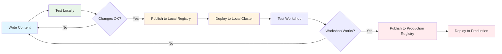

This page explains how Educates works from a workflow perspective, covering the lifecycle of workshops and sessions.

## Workshop Deployment Workflow

The following diagram illustrates how workshops are deployed and made available:

### Step-by-Step Process

1. **Workshop Definition**: An administrator creates a `Workshop` Custom Resource that defines:
   - Workshop content location (Git repo or container image)
   - Resource requirements
   - Required capabilities
   - RBAC permissions

2. **Training Portal Creation**: An administrator creates a `TrainingPortal` resource that:
   - References one or more workshops
   - Configures authentication
   - Sets up the web interface

3. **Workshop Environment Setup**: The operator creates a `WorkshopEnvironment` for each workshop:
   - Sets up a namespace for the workshop
   - Deploys shared resources (common to all sessions)
   - Configures the environment according to workshop requirements

4. **Portal Registration**: The workshop becomes available in the Training Portal catalog

## User Session Workflow

When a user accesses a workshop, the following workflow is triggered:

### Session Creation Process

1. **Session Request**: User selects a workshop from the Training Portal
2. **Session Allocation**: Portal checks for available pre-created sessions or creates a new one
3. **Namespace Creation**: Session Manager creates a dedicated namespace for the session
4. **Resource Setup**: 
   - RBAC policies are applied
   - Resource quotas are set
   - Required secrets are injected
5. **Capability Deployment**: Required capabilities are started:
   - Web terminal
   - VS Code editor
   - Kubernetes console
   - File server, Git server, etc.
6. **Per-Session Resources**: Workshop-specific resources are deployed to the session namespace
7. **Session Access**: User is redirected to the workshop session dashboard

## Workshop Content Workflow

The workflow for creating and publishing workshop content:

### Content Development Process

1. **Content Creation**: Workshop authors write content in Markdown (using Hugo format)
2. **Local Testing**: Content is tested using the local Educates environment
3. **Image Building**: Content is packaged into an OCI container image
4. **Image Publishing**: Image is pushed to a container registry
5. **Workshop Deployment**: Workshop CR is created referencing the image
6. **Content Updates**: For content-only changes, sessions can be updated without recreating

## Session Lifecycle

The lifecycle of a workshop session:

### Session States

- **Requested**: User has requested access to a workshop
- **Allocating**: Portal is finding or creating a session
- **Creating**: Session resources are being created
- **Starting**: Capabilities are being started
- **Ready**: Session is ready but not yet accessed
- **Active**: User is actively using the session
- **Idle**: Session is active but user is inactive
- **Expired**: Session has reached its time limit
- **Terminating**: Session is being cleaned up

## Resource Management Workflow

How resources are managed across the platform:

### Resource Hierarchy

1. **Workshop Environment Resources**: Deployed once per workshop, shared by all sessions
2. **Session Resources**: Deployed per session, isolated to each user
3. **Resource Quotas**: Applied at the session level to limit resource usage
4. **RBAC Policies**: Applied at the session level to control access

## Authentication and Authorization Workflow

How users are authenticated and authorized:

## Content Update Workflow

How workshop content updates are handled:

### Update Scenarios

1. **Content-Only Updates**: When only Markdown content changes:
   - Content can be updated in running sessions
   - No need to recreate workshop environments
   - Faster iteration during development

2. **Configuration Changes**: When workshop configuration changes:
   - New container image must be built
   - Workshop CR must be updated
   - Workshop environments may need to be recreated
   - Existing sessions continue until they expire

## Local Development Workflow

The workflow for developing workshops locally:

### Local Development Benefits

- **Fast Iteration**: Content updates can be tested immediately
- **Isolated Environment**: No impact on production
- **Full Feature Set**: Local environment includes all capabilities
- **Easy Debugging**: Direct access to cluster and resources

