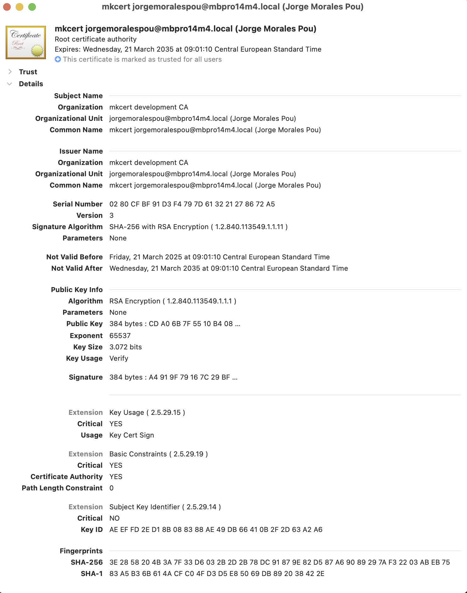

When you run Educates locally, it's easy to go with the defaults, just create your Educates cluster as explained
in the [Getting Started on Kind](/blog/getting-started-on-kind) article. 

But that is not the most optimal workflow. Why? 

Because we recommend using SSL for your local environment, and for that, we also recommend to use a recognizable 
DNS name for your cluster. This makes things easier, and also shields you from roaming, so that when you move 
from one location to another, and your ip changes, the `nip.io` address change don't affect you. Also, using a name
for your cluster makes things easier when you want to have your descriptors or config under version control.

We will demonstrate how to:

- Create a local Certificate Authority (CA) so that you can have trust between your local computer and your cluster
- Configure a local DNS resolver to provide your cluster with a recognizable name
- Create your cluster so that it uses both and creates ingresses to your workshops using working SSL

<!-- truncate -->

## Local CA

To have a local Certificate Authority (CA) is very handy for many things, but specially when you want to be able to generate
certificates that you can trust. Whether this certificates will be present in a cluster running on your machine
or directly on processes that run on your machine doesn't matter, what matters is that when you use those certificates
you don't get a browser warning when accessing a site served with them.


Even though the process is different on different operating systems, there's an open source tool that makes the process
quite easy for all. [mkcert](https://mkcert.dev) is a simple tool for making locally-trusted development certificates.
It requires no configuration.

We will use only the CA generation for the purpose of this blog, although in a later blog, we will also show how you
can configure Educates with a generated certificate, so that configuration in the cluster is more lightweight.

```
$ mkcert -install
Created a new local CA 💥
Sudo password:
The local CA is now installed in the system trust store! ⚡️
```

By running `mkcert -install` mkcert will create a CA and install it in the system trust store. If we look at our KeyChain (in MacOS)
we can see the details of our CA, which will be valid for the next 10 years (more than enough) 



This CA is saved in our local file system, in `$(mkcert -CAROOT)` as a file with name `rootCA.pem`, so we can see the
actual certificate by looking at that file:

```
$ cat "$(mkcert -CAROOT)/rootCA.pem"
-----BEGIN CERTIFICATE-----
MIIFFzCCA3+gAwIBAgIQAoDPv5HT9Hl9YTIhJ4ZypTANBgkqhkiG9w0BAQsFADCB
...
... CONTENT SKIPPED FOR BREVITY
...
0fJYVChf1WGHMTA=
-----END CERTIFICATE-----
```

# Configure our local recognizable name

Now it's time to give our local clusters a recognizable name, that is a DNS name that our machine will know how to find. 
There's multiple ways to achieve this goal, but the easiest one is using the `resolver` capability that Educates provides,
which internally uses `dnsmasq` and it's [properly documented](https://docs.educates.dev/en/stable/getting-started/local-environment.html#local-dns-resolver).

But before we do that, we need to decide on the name we're going to use, and set that name in educates local configuration.
I'm going to use `educates.test` so what I need to do is configure that in the local configuration as 
[documented here](https://docs.educates.dev/en/stable/getting-started/local-environment.html#custom-ingress-domain).

We go ahead an edit our local educates configuration via:
```
$ educates local config edit
```

And set our domain name:

```
clusterIngress:
  domain: educates.test
```

Now, we're all set to create our resolver:

```
$ educates local resolver deploy
Deploying local DNS resolver
{"status":"Pulling from jpillora/dnsmasq","id":"latest"}
{"status":"Digest: sha256:98b69ad825942089fb7c4b9153e3c5af0205eda3a103c691e30b1a13fd912830"}
{"status":"Status: Image is up to date for jpillora/dnsmasq:latest"}
```

This will start our resolver as a dnsmasq container on our local machine. Now there's one last step we need to do, which is
configure our local system to redirect requests to `educates.test` domain to our local resolver. In macOS we need
to create a file in `/etc/resolver` with the name of our domain, and configure our local nameserver (the dnsmasq container).

```
$ sudo mkdir /etc/resolver/
$ sudo sh -c "cat > /etc/resolver/educates.test << EOF
nameserver 127.0.0.1
EOF"
```

With this done, we are now have a recognizable name `educates.test` ready to use when working locally.

If we now try to access a url for that domain, we should see that it's trying to access our localhost's ip, although
it will fail since we have not created a cluster yet.

```
$ curl -v www.educates.test
* Host www.educates.test:80 was resolved.
* IPv6: (none)
* IPv4: 192.168.50.80
*   Trying 192.168.50.80:80...
* Connected to www.educates.test (192.168.50.80) port 80
> GET / HTTP/1.1
> Host: www.educates.test
> User-Agent: curl/8.7.1
> Accept: */*
>
* Request completely sent off
* Recv failure: Connection reset by peer
* Closing connection
curl: (56) Recv failure: Connection reset by peer
```

__NOTE__: `192.168.50.80` is the ip of my local box on my home network.

## Create your cluster with secure SSL for your domain

It is now time to go ahead and configure your cluster to use that name and expose your workshops in a secure way.
In order to do this, we will take advantage of the `educates CLI` once more. We need first to
create a local secret that will be `magically` used by our cluster with the CA we created before.

```
$ educates local secrets add ca educates.test-ca \
 --cert "`mkcert -CAROOT`/rootCA.pem" \
 --domain educates.test
```

This will create a local educates secret for certificates (CA in this case), that will be automatically
provided to all clusters which match our domain name.

Now, we need to also create a local secret for a TLS certificate for wildcard domain for `educates.test` 
so that every ingress created can be validated via that TLS certificate.

```
$ mkcert -key-file /tmp/key.pem -cert-file /tmp/cert.pem "*.educates.test" 
$ educates local secrets add tls educates.test-tls \
 --cert /tmp/cert.pem \
 --key /tmp/key.pem \
 --domain educates.test
```

__NOTE__: We used a temporary directory as we only care about the educates secret, but you could save these 
generated certificates for later use.

There will be now two educates secrets available on your machine:

```
$ educates local secrets list
educates.test-ca
educates.test-tls
```

We can now see that our local configuration for our educates cluster is augmented with this secret:

```
$ educates local config view
clusterInfrastructure:
  provider: kind
clusterIngress:
  domain: educates.test
  tlsCertificateRef:
    namespace: educates-secrets
    name: educates.test-tls
  caCertificateRef:
    namespace: educates-secrets
    name: educates.test-ca
```

Although, if we edit the local configuration that `tlsCertificateRef` and the `caCertificateRef` snippets are not present, 
as those are provided by the `educates CLI` automatically.

It's now time to create our cluster:

```
$ educates local cluster create
```

Once the cluster is created, we can go ahead and deploy a sample workshop to verify that everything works
as we expected:

```
$ educates deploy-workshop -f https://github.com/educates/lab-k8s-fundamentals/releases/latest/download/workshop.yaml
```

And access our workshop:

```
$ educates browse-workshops
Training portal "educates-cli".
Checking training portal is ready.
Opening training portal https://educates-cli-ui.educates.test/workshops/access/?password=7u%3F8eGJ%2BpV7M&redirect_url=%2F.
```

We can see that the URL for the portal is at `educates.test` and when we access the trainingportal, we can see that the
browser shows a valid certificate and that the connection is secure.


## Summary

This is the recommended way to configure your local environment for working with educates, because it will be the closest you will
get to a real environment with regards to how the workshops are exposed and accessed.

Keep in mind that all of what we have done here is a one time configuration setup. Once you have gone through all the steps
here described, you will be able to destroy and create clusters that will be accessible via TLS at that recognizable name.
