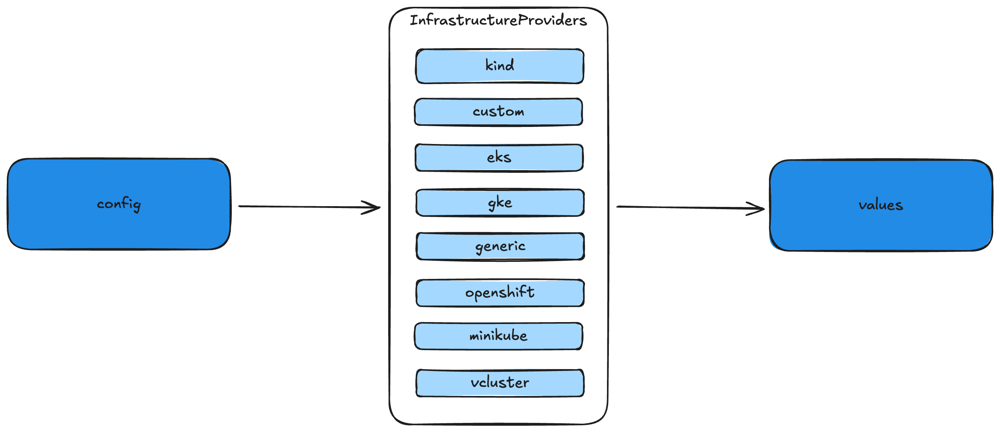

In **Educates 3.0**, we introduced a new installer mechanism designed to simplify the deployment of Educates on your preferred cluster infrastructure. This new approach provides an opinionated yet flexible way to set up the platform, addressing common challenges faced by our users.

Before Educates 3.0, installation was limited to deploying the Educates Training Platform on an existing Kubernetes cluster. However, we realized that many users lacked the technical expertise to configure a fully functional Kubernetes cluster with all the necessary prerequisites. Tasks such as setting up an ingress controller, managing certificates, configuring DNS, and enforcing policies often posed significant barriers to adoption. To address this, we developed a streamlined installer that abstracts these complexities, making it easier for users to adopt the Educates Training Platform.

In this article, we’ll explore how the new installer works, the supported cluster infrastructure providers in **Educates 3.2.0**, and the design decisions behind its implementation. Let’s dive in!

---

## Backward Compatibility with Educates 2.x

One of our key goals with Educates 3.x was to maintain backward compatibility with Educates 2.x or, at the very least, ensure a smooth transition for users upgrading to the new version.

In Educates 2.x, the platform was installed using [Carvel's kapp-controller](https://carvel.dev/kapp-controller/). This required the target cluster to have kapp-controller pre-installed. The Educates CLI automated this process for local clusters via the `educates create-cluster` command.

The installation process in Educates 2.x involved two main steps:

1. **Cluster Prerequisites Installation**: Pre-requisites like [Contour](https://projectcontour.io) and [Kyverno](https://kyverno.io) were installed using Carvel Packages (or Apps). Configuration was managed through a dedicated configuration file, as outlined in the [2.x documentation](https://docs.educates.dev/en/2.7.x/installation-guides/installation-instructions.html#installing-cluster-essentials).

2. **Platform Installation**: The Educates Training Platform itself was installed as another Carvel Package, with its configuration defined in a separate file.

For local clusters, both configurations were often combined into a single file, though each deployment process only referenced the relevant sections.

---

## Enhancements in Educates 3.x

With Educates 3.x, we retained the familiar configuration file format but expanded its capabilities. The new installer introduces several key improvements:

1. **Integrated Installer**: The installer is now part of the Educates CLI, written in Golang. It leverages Carvel tools as internal libraries for tasks such as configuration templating, image resolution, and Kubernetes resource deployment.

2. **Infrastructure-Aware Configuration**: The installer adapts the configuration based on the target cluster infrastructure provider. This allows us to provide opinionated defaults that simplify the installation process for less experienced users while remaining flexible for advanced users.

3. **Augmented Configuration**: The configuration file now supports additional settings, such as specifying the `clusterInfrastructure.provider`. This enables the installer to tailor the deployment process to the chosen provider.

---

## How the Installer Works

The installer processes the user-provided configuration into a more detailed and opinionated set of values required by the target cluster infrastructure provider. For example, running the command:

```bash
educates admin platform config --local-config
```

Generates a default configuration for a local cluster, which might look like this:

```yaml
clusterInfrastructure:
  provider: kind
clusterPackages:
  contour:
    enabled: true
    settings: {}
  kyverno:
    enabled: true
    settings: {}
  educates:
    enabled: true
    settings: {}
clusterSecurity:
  policyEngine: kyverno
clusterIngress:
  domain: 172.20.10.12.nip.io
workshopSecurity:
  rulesEngine: kyverno
```

This configuration is then transformed by the installer into a more detailed set of values specific to the chosen infrastructure provider. For example, running:

```bash
educates admin platform values --local-config
```

Produces the following output:

```yaml
clusterPackages:
  contour:
    enabled: true
    settings:
      infraProvider: kind
      contour:
        replicas: 1
      configFileContents:
        defaultHttpVersions:
        - HTTP/1.1
      service:
        type: ClusterIP
        useHostPorts: true
  cert-manager:
    enabled: false
    settings: {}
  external-dns:
    enabled: false
    settings: {}
  certs:
    enabled: false
    settings: {}
  kyverno:
    enabled: true
    settings: {}
  kapp-controller:
    enabled: false
    settings: {}
  educates:
    enabled: true
    settings:
      imageVersions:
      - name: session-manager
        image: ghcr.io/educates/educates-session-manager:3.2.0
      - name: training-portal
        image: ghcr.io/educates/educates-training-portal:3.2.0
      - name: docker-registry
        image: ghcr.io/educates/educates-docker-registry:3.2.0
      - name: pause-container
        image: ghcr.io/educates/educates-pause-container:3.2.0
      - name: base-environment
        image: ghcr.io/educates/educates-base-environment:3.2.0
      - name: jdk8-environment
        image: ghcr.io/educates/educates-jdk8-environment:3.2.0
      - name: jdk11-environment
        image: ghcr.io/educates/educates-jdk11-environment:3.2.0
      - name: jdk17-environment
        image: ghcr.io/educates/educates-jdk17-environment:3.2.0
      - name: jdk21-environment
        image: ghcr.io/educates/educates-jdk21-environment:3.2.0
      - name: conda-environment
        image: ghcr.io/educates/educates-conda-environment:3.2.0
      - name: secrets-manager
        image: ghcr.io/educates/educates-secrets-manager:3.2.0
      - name: tunnel-manager
        image: ghcr.io/educates/educates-tunnel-manager:3.2.0
      - name: image-cache
        image: ghcr.io/educates/educates-image-cache:3.2.0
      - name: assets-server
        image: ghcr.io/educates/educates-assets-server:3.2.0
      - name: lookup-service
        image: ghcr.io/educates/educates-lookup-service:3.2.0
      - name: debian-base-image
        image: debian:sid-20230502-slim
      - name: docker-in-docker
        image: docker:27.5.1-dind
      - name: rancher-k3s-v1.27
        image: rancher/k3s:v1.27.14-k3s1
      - name: rancher-k3s-v1.28
        image: rancher/k3s:v1.28.10-k3s1
      - name: rancher-k3s-v1.29
        image: rancher/k3s:v1.29.5-k3s1
      - name: rancher-k3s-v1.30
        image: rancher/k3s:v1.30.1-k3s1
      - name: loftsh-vcluster
        image: loftsh/vcluster:0.18.1
      clusterIngress:
        domain: 172.20.10.12.nip.io
      clusterSecurity:
        policyEngine: kyverno
      workshopSecurity:
        rulesEngine: kyverno
```

This transformation ensures that the configuration is optimized for the specific infrastructure provider while maintaining the flexibility to customize settings as needed.



---

## Supported Infrastructure Providers

Educates 3.x supports a variety of cluster infrastructure providers, each with its own set of opinionated defaults. These providers are defined in the [Educates repository](https://github.com/educates/educates-training-platform/tree/develop/carvel-packages/installer/bundle/config/ytt/_ytt_lib/infrastructure) and include configurations for packages such as [Contour](https://projectcontour.io) and [Kyverno](https://kyverno.io).

Refer to the official documentation for more details on the [configuration format](https://docs.educates.dev/en/stable/installation-guides/configuration-settings.html) and [supported infrastructure providers](https://docs.educates.dev/en/stable/installation-guides/infrastructure-providers.html).

---

## Conclusion

The new installer in Educates 3.x represents a significant step forward in simplifying the deployment process. By integrating the installer into the CLI, providing infrastructure-aware configurations, and maintaining backward compatibility, we’ve made it easier than ever to deploy Educates on a variety of Kubernetes environments.

In the next part of this series, we’ll take a closer look at the specific cluster infrastructure providers supported by the installer and the rationale behind our opinionated defaults. Stay tuned!