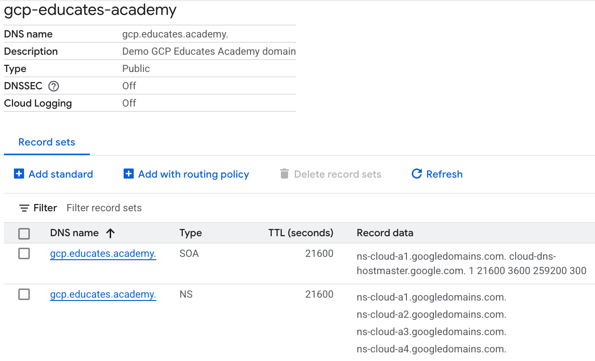
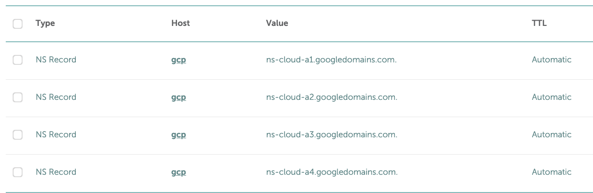
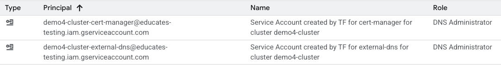
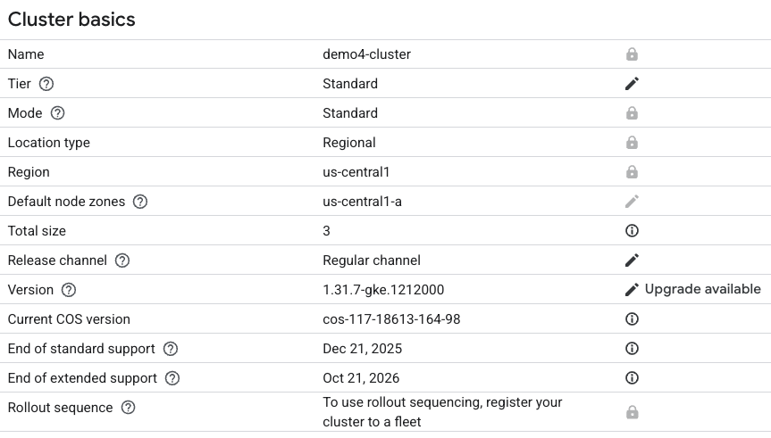
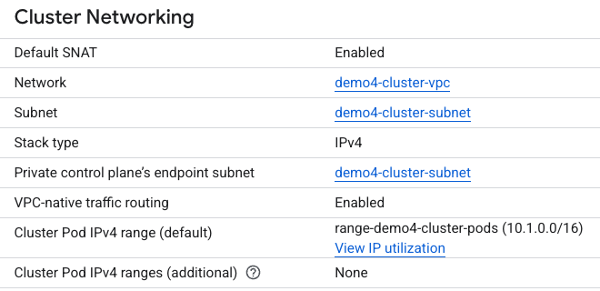
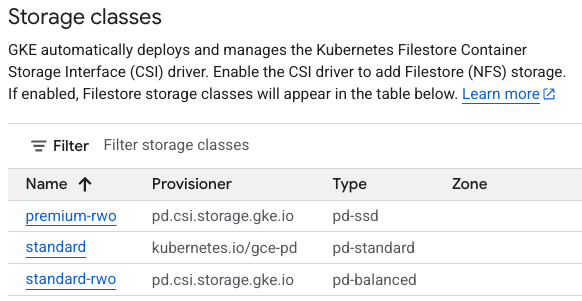

In the [How the install works](/blog/how-installer-works-part-1) post,
we covered the highlights of how the new **Educates 3.0** cli can be
used to install Educates locally.

In this post,
we cover how to use the Educates CLI to install on a Cloud Provider,
and specifically Google Cloud.

<!-- truncate -->

---
## Prerequisites

The Educates 3.x installer will handle some of the ingress prerequisites,
as Educates ingress requirements are quite sophisticated.

But there are various prerequisites that are required before running the Educates CLI:

1.  **DNS**: A DNS Zone must be configured for the domain/subdomain assigned for
    use in your cluster.
    If you are using a subdomain,
    the root domain DNS zone must have the NS records of the associated subdomain
    zone NS records.

2.  **K8s workload identity**: Your Educates K8s cluster will need access
    to read from and write to your Cloud Provider DNS provider.
    Your Cloud Provider will provide a feature to map IAM service account
    to service accounts that Educates will configure for DNS access.

3.  **K8s Cluster**: The cluster must have network access for ingress,
    egress, and internal K8s access.
    It must also have read/write access to attached storage.

We'll explore the Educates Ingress architecture in a separate post.

## Configuration

Before installing Educates with the CLI,
you will need to construct a configuration file
with the necessary infrastructure parameters:

-   Which provider and account you wish to deploy to

-   DNS Zone containing name servers and start-of-authority
    for your Ingress host name.

-   K8s Workload IAM Service Accounts

-   Security Policy Engine

-   Ingress Domain

Note that the DNS Zone parameter may have a default based on your Cloud Provider.
The default for the Security Policy Engine is `kyverno`.

You can read about the various configuration options in the
[Educates Infrastructure Providers documentation](https://docs.educates.dev/en/stable/installation-guides/infrastructure-providers.html#infrastructure-providers).

## Installation

Once you have the K8s cluster prerequisites and a configuration,
install Educates running the CLI:

```bash
educates deploy-platform --config <path to config file>
```

You can read about the CLI installation in the Educates documentation
[here](https://docs.educates.dev/en/stable/installation-guides/cli-based-installation.html#cli-based-installation).

---
## Example using Google Cloud

### Prerequisites

-   Cloud DNS is configured with the subdomain zone:

    

-   Root DNS configured with the delegate subdomain records:

    

-   IAM Service Account:

    

    *Note*: Also check out the Service Account
    to make sure it has the *Workload Identity User* role.

-   GKE Cluster provisioned:
    -   Basics:

        

    -   Network:

        

    -   Storage:

        

### Configure

The following is the Educates configuration:

```yaml
clusterInfrastructure:
  provider: "gke"
  gcp:
    project: "educates-testing"
    cloudDNS:
      zone: "gcp.educates.academy"
    workloadIdentity:
      external-dns: "demo4-cluster-external-dns@educates-testing.iam.gserviceaccount.com"
      cert-manager: "demo4-cluster-cert-manager@educates-testing.iam.gserviceaccount.com"
clusterSecurity:
  policyEngine: "kyverno"
clusterIngress:
  domain: "gcp.educates.academy"
```

Note that the ingress maps the subdomain configured in the DNS zone,
and the `workloadIdentity` parameters map the IAM service accounts previously
verified in the prerequisites.

---
### Running the CLI

Install Educates by running the CLI with the supplied configuration:

```bash
educates deploy-platform --config ./config.yaml
```

You can see example output here:

<AsciinemaPlayer src="/asciinemas/install-educates-on-gcloud.cast" autoPlay={true} loop={true} />

You can also watch the accompanying video with additional
installation details:

<iframe width="560" height="315" src="https://www.youtube.com/embed/C6vCd6Nhf5M?hl=en&cc_lang_pref=en&cc_load_policy=1" title="YouTube video player" frameborder="0" allow="accelerometer; autoplay; clipboard-write; encrypted-media; gyroscope; picture-in-picture; fullscreen; web-share" referrerpolicy="strict-origin-when-cross-origin" allowfullscreen></iframe>

---
## Supported Cloud Providers

Educates 3.x supports two IaaS-based Cloud Providers.
You can read more about their configurations here:

- [Amazon EKS](https://docs.educates.dev/en/stable/installation-guides/infrastructure-providers.html#installation-to-amazon-eks)
- [Google GKE](https://docs.educates.dev/en/stable/installation-guides/infrastructure-providers.html#installation-to-google-gke)

*Note*: While OpenShift and vCluster are considered remote cloud providers,
they are not Standalone IaaS Cloud providers.

---

## Conclusion

Like in the [How the install works](/blog/how-installer-works-part-1) post,
We saw that the new installer in Educates 3.x simplifies the deployment process,
and that Educates handles the heavy lifting of ingress, endpoint
and certificate management.

In the next part of this series, we'll walk through verification
of the Educates installation on a cloud provider cluster.