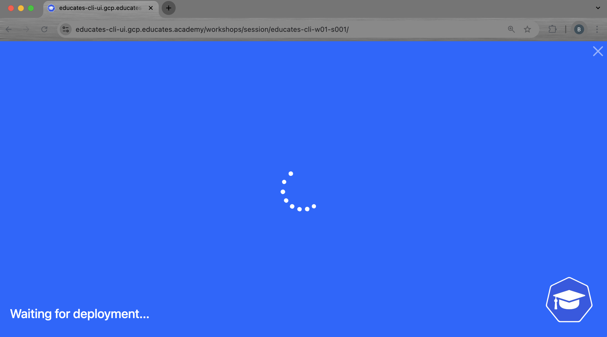

In the [Installing Educates on a cloud provider](/blog/install-educates-cloud-cli) post,
we covered the highlights of installing **Educates 3.x** on Google Cloud using
the Educates cli.

This post is the second part,
verification of the installation including the following:

- Verification of the platform components
- Deploy and verify a training portal and workshop

We decided to make this a separate post,
as the verification steps are agnostic to the cloud platform.

Note that we do not do a deep-dive discussion of the architecture
or installed components.
We will have subsequent posts dissecting the Educates architecture
to discuss how the components interact.

<!-- truncate -->

---
## Prerequisites

-   A successful installation of Educates on a Cloud Provider.
    See [Installing Educates on a cloud provider](/blog/install-educates-cloud-cli).

-   We assume the reader is familiar with [Kubernetes (K8s)](https://kubernetes.io/)
     and its API.

-   `KUBECONFIG` setup to point to the Educates cluster to be verified.

-   `kubectl` and `educates` CLIs are are installed.

---

## Platform overview

Use the following diagram to reference the prerequisite components:


---

## Platform verification

In this section,
we will walk through the status of the platform resources.

As a general rule,
if you do not see the K8s resources shown running in ready state,
the Educates cluster will not service portals and workshops correctly.

### Ingress

The following are the steps to verify functioning ingress:

1.  Verify the contour deployment:

    ```bash
    kubectl get deployments -n projectcontour -o wide
    ```

    We see the following output:

    ```
    NAME      READY   UP-TO-DATE   AVAILABLE   AGE   CONTAINERS   IMAGES                                                                                                   SELECTOR
    contour   2/2     2            2           1h   contour      ghcr.io/projectcontour/contour@sha256:ba4fd19911bd603e3857fafdd17bd44c687ea1ab52b12f8ddc7971ba68f9b532   app=contour
    ```

2.  Verify the Contour Envoy deployment:

    ```bash
    kubectl get daemonsets -n projectcontour -o wide
    ```

    We see the following output:

    ```
    NAME    DESIRED   CURRENT   READY   UP-TO-DATE   AVAILABLE   NODE SELECTOR   AGE   CONTAINERS               IMAGES                                                                                                                                                                                                            SELECTOR
    envoy   3         3         3       3            3           <none>          1h   shutdown-manager,envoy   ghcr.io/projectcontour/contour@sha256:ba4fd19911bd603e3857fafdd17bd44c687ea1ab52b12f8ddc7971ba68f9b532,index.docker.io/envoyproxy/envoy@sha256:2ef22f7a72d3008d68bd4912f52b9a3d466d00db31a567dffa1b103e42eb9198   app=envoy
    ```

3.  Verify the cert-manager deployment:

    ```bash
    kubectl get deployments -n cert-manager -o wide
    ```

    We see the following output:

    ```
    NAME                      READY   UP-TO-DATE   AVAILABLE   AGE   CONTAINERS                IMAGES                                                                                                             SELECTOR
    cert-manager              1/1     1            1           1h   cert-manager-controller   quay.io/jetstack/cert-manager-controller@sha256:abe34d3c2a4834258b0365f1cd6ebd2fcf7f133fb9e6c3b9d4fb6cec8975d61a   app.kubernetes.io/component=controller,app.kubernetes.io/instance=cert-manager,app.kubernetes.io/name=cert-manager
    cert-manager-cainjector   1/1     1            1           1h   cert-manager-cainjector   quay.io/jetstack/cert-manager-cainjector@sha256:ecf0a3e7997f17784e061e49e1f53fc299812b329ec768bd601f1c521cea2658   app.kubernetes.io/component=cainjector,app.kubernetes.io/instance=cert-manager,app.kubernetes.io/name=cainjector
    cert-manager-webhook      1/1     1            1           1h   cert-manager-webhook      quay.io/jetstack/cert-manager-webhook@sha256:1c3d73c2fb81e16d059ffee3449d33760144d0e5cf421f4ee08f46e126bea140      app.kubernetes.io/component=webhook,app.kubernetes.io/instance=cert-manager,app.kubernetes.io/name=webhook
    ```

4.  Verify the External DNS deployment:

    ```bash
    kubectl get deployments -n external-dns -o wide
    ```

    We see the following output:

    ```
    NAME           READY   UP-TO-DATE   AVAILABLE   AGE   CONTAINERS     IMAGES                                                                                                              SELECTOR
    external-dns   1/1     1            1           1h   external-dns   registry.k8s.io/external-dns/external-dns@sha256:3fcad62c4a9a8a72cb2db5ce7adeb121be66cac5f7f5ddad43684c2b20c72aa5   app=external-dns
    ```

6.  Verify the wildcard certificate:

    ```bash
    kubectl get certificates.cert-manager.io -n projectcontour --output wide
    ```

    We see the following output:

    ```
    NAME               READY   SECRET             ISSUER             STATUS                                          AGE
    educateswildcard   True    educateswildcard   educateswildcard   Certificate is up to date and has not expired   1h
    ```

    Note that the certificate is ready, and its status is up-to-date and not expired.

    **If the certificate ready state is `False`,**
    **TLS ingress will break.**

### Operator workloads

1.  Verify the operator deployments:

    ```bash
    kubectl get deployments -n educates -o wide
    ```

    We see the following output:

    ```
    NAME              READY   UP-TO-DATE   AVAILABLE   AGE   CONTAINERS   IMAGES                                                                                                              SELECTOR
    secrets-manager   1/1     1            1           1h   operator     ghcr.io/educates/educates-secrets-manager@sha256:a21cc5ce05a5e447680efbdf36d9a410eae73d0db48807c075a0a4229c1f8a38   deployment=secrets-manager
    session-manager   1/1     1            1           1h   operator     ghcr.io/educates/educates-session-manager@sha256:20ff656e641aa3155a3ff5a02c215964f1d88ca4435f72d029845d0afac90765   deployment=session-manager
    ```

1.  Verify the image pullers:

    ```bash
    kubectl get daemonsets -n educates -o wide
    ```

    We see the following output:

    ```
    NAME           DESIRED   CURRENT   READY   UP-TO-DATE   AVAILABLE   NODE SELECTOR   AGE   CONTAINERS   IMAGES                                                                                                              SELECTOR
    image-puller   3         3         3       3            3           <none>          1h   pause        ghcr.io/educates/educates-pause-container@sha256:f56481cab3485964d9072eb03011e3a6b145c35b7b92cec9d0439cd459b348eb   app=image-puller
    ```

### Security policy engine

1.  Verify kyverno deployments:

    ```bash
    kubectl get deployments -n kyverno -o wide
    ```

    We see the following output:

    ```
    NAME                            READY   UP-TO-DATE   AVAILABLE   AGE   CONTAINERS   IMAGES                                                                                                          SELECTOR
    kyverno-admission-controller    1/1     1            1           1h   kyverno      ghcr.io/kyverno/kyverno@sha256:c4f44e3cc9999d75bd54cccf4e2ceacf50c6d3170461109677c7383154d15fdb                 app.kubernetes.io/component=admission-controller,app.kubernetes.io/instance=kyverno,app.kubernetes.io/part-of=kyverno
    kyverno-background-controller   1/1     1            1           1h   controller   ghcr.io/kyverno/background-controller@sha256:46f1f19b7c71b0116eb8f8768bdbeeb2c8762b8831e158ceed1b2b3fc0b0ed34   app.kubernetes.io/component=background-controller,app.kubernetes.io/instance=kyverno,app.kubernetes.io/part-of=kyverno
    kyverno-cleanup-controller      1/1     1            1           1h   controller   ghcr.io/kyverno/cleanup-controller@sha256:79f6a4824063c2078921107b322d04847d5fbdcfac8a054fe4a50eeed621445a      app.kubernetes.io/component=cleanup-controller,app.kubernetes.io/instance=kyverno,app.kubernetes.io/part-of=kyverno
    kyverno-reports-controller      1/1     1            1           1h   controller   ghcr.io/kyverno/reports-controller@sha256:e9cddf1464cbd9625aa02d6ce239b37a18a29a3f9a7c16851c08d68831cde83a      app.kubernetes.io/component=reports-controller,app.kubernetes.io/instance=kyverno,app.kubernetes.io/part-of=kyverno
    ```

---

## Workshop verification

In this section,
we will walk through the verification of a
[workshop](https://docs.educates.dev/en/stable/custom-resources/workshop-definition.html),
its [portal](https://docs.educates.dev/en/stable/custom-resources/training-portal.html)
and associated [workshop environment](https://docs.educates.dev/en/stable/custom-resources/workshop-environment.html).

As a general rule,
if you do not see the K8s resources shown,
the Educates cluster likely will not service user
[workshop sessions](https://docs.educates.dev/en/stable/custom-resources/workshop-session.html).

### Deploy workshop and portal

1.  Install the sample workshop and portal:

    ```bash
    educates deploy-workshop -f https://github.com/educates/lab-k8s-fundamentals/releases/latest/download/workshop.yaml
    ```

    We see the following output:

    ```
    Loaded workshop "educates-cli--lab-k8s-fundamentals-a817ec1".
    Creating new training portal "educates-cli".
    Workshop added to training portal.
    ```

### Verify workshop and portal deployments

2.  We verify the portal and workshop components via the `educates` cli:

    ```bash
    educates list-portals
    educates list-workshops
    ```

    We see the following output:

    ```
    NAME           CAPACITY   URL
    educates-cli   5          https://educates-cli-ui.gcp.educates.academy
    NAME                                         ALIAS   CAPACITY   SOURCE
    educates-cli--lab-k8s-fundamentals-a817ec1           5          https://github.com/educates/lab-k8s-fundamentals/releases/latest/download/workshop.yaml
    ```

3.  We also verify the workshops, training portals, and associated workshop environments
    querying the Educates custom resources:

    ```bash
    kubectl get trainingportals.training.educates.dev
    kubectl get workshops.training.educates.dev
    kubectl get workshopenvironments.training.educates.dev
    ```

    We see the following output:

    ```
    NAME           URL                                            PORTALPASSWORD   ADMINUSERNAME   ADMINPASSWORD                      STATUS    MESSAGE
    educates-cli   https://educates-cli-ui.gcp.educates.academy   <redacted>       <redacted>      <redacted>                         Running
    NAME                                         URL
    educates-cli--lab-k8s-fundamentals-a817ec1
    NAME               WORKSHOP                                     URL   STATUS    MESSAGE
    educates-cli-w01   educates-cli--lab-k8s-fundamentals-a817ec1         Running
    ```

    Note that in both outputs we see the portal url.

    The portal resource is an instance of the `TrainingPortal` custom resource type,
    while the workshop resource is an instance of the `Workshop`,
    and the workshop environment resource is an instance of the `WorkshopEnvironment`.

    Keep in mind the name of the workshop environment `educates-cli-w01`,
    we will need that later when verifying workshop session workloads.
    The workshop session deployments run in a namespace associated with the
    workshop environment (see the [platform architecture diagram above](#platform-overview)).

    Notice the difference between the `educates` and `kubectl` outputs.
    In the latter we see credentials for the training portal access,
    where as the `educates` output does not show them.

4.  Get the portal credential from the `educates` cli.

    ```bash
    educates view-credentials
    ```

    will output the `PORTALPASSWORD` value as we saw in the `kubectl` output.

    *Note that the portal password is not normally used in secure-hardened environments.*

### Browse the portal catalog

Normally a user will access Educates either directly through a training
portal website by its url (as previously shown in the portal outputs),
or indirectly through a web site that embeds Educates,
and launch [workshop sessions](https://docs.educates.dev/en/stable/custom-resources/workshop-session.html)
 via API.

The educates CLI does have a short cut that will automatically
post the URL in a browser window:

1.  Execute the following command:

    ```bash
    educates browse-workshops
    ```

    We see the following output:

    ```
    Training portal "educates-cli".
    Checking training portal is ready.
    Opening training portal https://educates-cli-ui.gcp.educates.academy/workshops/access/?password=<redacted>&redirect_url=%2F.
    ```

2.  We also see a browser window open.
    If this were the first time deploying this workshop to the cluster,
    we would be prompted for a password.
    Use the output of the `educates view-credentials` command.

    We then see the portal UI,
    that shows a single workshop
    in the portal's workshop catalog:

    

### Launch a workshop session

1.  Click on the *Start workshop* button of the only
    workshop shown.
    The browser will redirect to the following url:

    

    We can probably reason that the workshop session id `educates-cli-w01-s001`.
    gives some information:

    -   `educates-cli-w01` is the associated workshop environment.

    -   `s001` is a unique identifier for a particular session associated
        with the workshop environment.

    Remember the session id for later,
    we will see it can be used to reference K8s resources.

    We initially see a progress spinner like this:

    

2.  After 10 seconds or so,
    We see the workshop overview page:

    

3.  In the top terminal window,
    run the following command:

    ```bash
    env|grep SESSION
    ```

    This will show something like this:

    ```
    TERMINAL_SESSION_ID=1
    SESSION_ID=s001
    SESSION_HOSTNAME=educates-cli-w01-s001.gcp.educates.academy
    SESSION_NAMESPACE=educates-cli-w01-s001
    SESSION_URL=https://educates-cli-w01-s001.gcp.educates.academy
    SESSION_COOKIE_DOMAIN=
    SESSION_NAME=educates-cli-w01-s001
    ```

    We see the relationship of the environment variables to the
    workshop url.

4.  When running the browser developer tools network view,
    We see the browser interact with the workshop session endpoint:

    

### Verify workshop session

Let us now look at the workshop session in the educates cluster:

1.  List workshop sessions via `educates` cli:

    ```bash
    educates list-sessions
    ```

    We see the following output:

    ```
    NAME                    PORTAL         ENVIRONMENT        STATUS
    educates-cli-w01-s001   educates-cli   educates-cli-w01   Allocated
    ```

2.  List workshop sessions via `kubectl` cli:

    ```bash
    kubectl get workshopsessions.training.educates.dev
    ```

    We see the following output:

    ```
    NAME                    URL                                                  USERNAME   PASSWORD   STATUS      MESSAGE
    educates-cli-w01-s001   https://educates-cli-w01-s001.gcp.educates.academy                         Allocated
    ```

    Note the workshop session names match that we see from the
    workshop URL,
    and the URLs match between the browser network trace and the backend URL.

### Verify workshop session K8s resources

So far we have seen the Educates custom resources.
What about how that translates to Kubernetes workloads?

Let us look at that now.

1.  Look at the k8s resources in the workshop environment namespace `educates-cli-w01`:

    ```bash
    kubectl get deploy,svc,ingress -n educates-cli-w01 -o wide
    ```

    We the following deployments, services and ingresses:

    ```
    NAME                                    READY   UP-TO-DATE   AVAILABLE   AGE   CONTAINERS   IMAGES                                                                                                               SELECTOR
    deployment.apps/educates-cli-w01-s001   1/1     1            1           13m   workshop     ghcr.io/educates/educates-base-environment@sha256:02aec83f20ff16a3d9d6ca757c7da80769134d3ede431b0a6875c18fefc1f2c2   deployment=educates-cli-w01-s001

    NAME                            TYPE        CLUSTER-IP    EXTERNAL-IP   PORT(S)   AGE   SELECTOR
    service/educates-cli-w01-s001   ClusterIP   10.2.12.209   <none>        80/TCP    13m   deployment=educates-cli-w01-s001

    NAME                                              CLASS    HOSTS                                                                                                                                                          ADDRESS         PORTS     AGE
    ingress.networking.k8s.io/educates-cli-w01-s001   <none>   educates-cli-w01-s001.gcp.educates.academy,console-educates-cli-w01-s001.gcp.educates.academy,educates-cli-w01-s001-console.gcp.educates.academy + 2 more...   34.72.234.135   80, 443   13m
    ```

    We see that the workshop session includes a deployment that provides the development container
    where the workshop session runs (similar to [devcontainers](https://containers.dev/)),
    as well as service and ingress that support integration with the UI.

    At this point,
    we could terminate the workshop session through the UI,
    or,
    just wait for it to time out.

---

That takes us to the end of the Educates cluster verification process.

In future posts we will explore in more depth how the resources work together,
architecture, and workshop session lifecycle.

---

## Video

You can also watch the accompanying video for more context:

<iframe width="560" height="315" src="https://www.youtube.com/embed/bsPbl-5rKDI?si=OWBwseWIZIKBZVz-" title="YouTube video player" frameborder="0" allow="accelerometer; autoplay; clipboard-write; encrypted-media; gyroscope; picture-in-picture; fullscreen; web-share" referrerpolicy="strict-origin-when-cross-origin" allowfullscreen></iframe>

---

## Conclusion

We verified the platform installation,
as well as a minimal acceptance of a sample training portal
and workshop deployment.

In the next part of this series, we'll walk through the ingress architecture
of a cloud provider installation.
