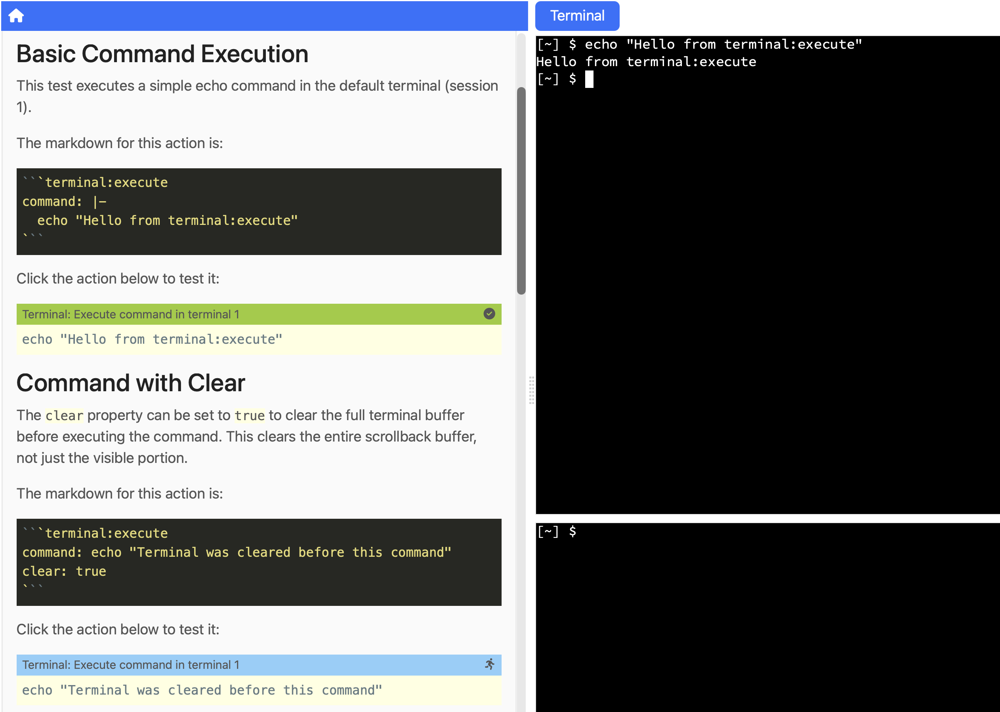
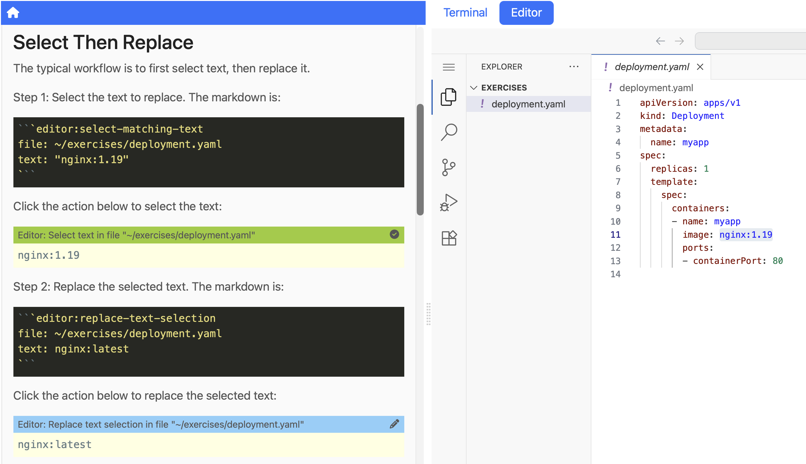

The idea of guided instruction in tutorials isn't new. Most online tutorials these days provide a click-to-copy icon next to commands and code snippets. It's a useful convenience. You see the command you need to run, you click the icon, and it lands in your clipboard ready to paste. Better than selecting text by hand and hoping you got the right boundaries.

But this convenience only goes so far. The instructions still assume you have a suitable environment set up on your own machine. The commands might reference tools you haven't installed, paths that don't exist in your setup, or configuration that differs from what the tutorial expects. The copy button solves the mechanics of getting text into your clipboard, but the real friction is in the gap between the tutorial and your environment. You end up spending more time troubleshooting your local setup than actually learning the thing the tutorial was supposed to teach you.

<!-- truncate -->

## Hosted environments and the copy/paste problem

Online training platforms like [Instruqt](https://instruqt.com/) and [Strigo](https://strigo.io/) improved on this by providing VM-based environments that are pre-configured and ready to go. You don't need to install anything locally. The environment matches what the instructions expect, so commands and paths should work as written. That eliminates the entire class of problems around "works on the tutorial author's machine but not on mine."

The interaction model, though, is still copy and paste. You read instructions in one panel, find the command you need, copy it, switch to the terminal panel, paste it, and run it. For code changes, you copy a snippet from the instructions and paste it into a file in the editor. It works, but it's a manual process that requires constant context switching between panels. Every copy and paste is a small interruption, and over the course of a full workshop those interruptions add up. Learners end up spending mental energy on the mechanics of following instructions rather than on the material itself.

## When commands became clickable

[Katacoda](https://www.katacoda.com/), before it was shut down by O'Reilly in 2022, included an improvement to this model. Commands embedded in the workshop instructions were clickable. Click on a command and it would automatically execute in the terminal session provided alongside the instructions. No copying, no pasting, no switching between panels. The learner reads the explanation, clicks the command, and watches the result appear in the terminal. The flow from reading to doing became much more seamless.

This was a meaningful step forward for terminal interactions specifically. But it only covered one part of the workflow. For code changes, editing configuration files, or any interaction that involved working with files in an editor, you were still back to the copy and paste model. The guided experience had a gap. Commands were frictionless, but everything else still required manual effort.

## Educates and the fully guided experience

[Educates](https://github.com/educates/educates-training-platform/) takes the idea of clickable actions and extends it across the entire workshop interaction. The workshop dashboard provides instructions alongside live terminals and an embedded VS Code editor. Throughout the instructions, learners encounter clickable actions that cover not just running commands, but the full range of things you'd normally do in a hands-on technical workshop.

Terminal actions work the way Katacoda relied on. Click on a command in the instructions and it runs in the terminal. But Educates goes further by providing a full set of editor actions as well. Clickable actions can open a file in the embedded editor, create a new file with specified content, select and highlight specific text within a file, and then replace that selected text with new content. You can append lines to a file, insert content at a specific location, or delete a range of lines. All of it driven by clicking on actions in the instructions rather than manually editing files.

Educates also includes YAML-aware editor actions, which is significant because YAML editing is notoriously error-prone when done by hand. A misplaced indent or a missing space after a colon can break an entire configuration file, and debugging YAML syntax issues is not what anyone signs up for in a workshop about Kubernetes or application deployment. The YAML actions let you reference property paths like `spec.replicas` or `spec.template.spec.containers[name=nginx]` and set values, add items to sequences, or replace entries, all while preserving existing comments and formatting in the file.

Beyond editing, Educates provides examiner actions that run validation scripts to check whether the learner has completed a step correctly. In effect, the workshop can grade the learner's work and provide immediate feedback. If they missed a step or made an error, they find out right away rather than discovering it three steps later when something else breaks. There are also collapsible section actions for hiding optional content or hints until the learner needs them, and file transfer actions for downloading files from the workshop environment to the learner's machine or uploading files into it.

The end result is that learners can progress through an entire workshop without ever manually typing a command, editing a file by hand, or wondering whether they've completed a step correctly. They focus on understanding the concepts being taught while the clickable actions handle the mechanics. That changes the experience fundamentally. Instead of the workshop being something you push through, it becomes something that carries you forward.

## The dashboard in action

To get a sense for what this looks like in practice, here are a couple of screenshots from an Educates workshop.

<!-- TODO: Add screenshot showing terminal:execute action in instructions with command result in terminal -->


The instructions panel on the left contains a clickable action for running a command. When the learner clicks it, the command executes in the terminal panel and the output appears immediately. No copying, no pasting, no typing.

<!-- TODO: Add screenshot showing editor with text selected/replaced via clickable actions -->


Here the embedded editor shows the result of a select-and-replace flow. The instructions guided the learner through highlighting specific text in a file and then replacing it with updated content, all through clickable actions. The learner sees exactly what changed and why, without needing to manually locate the right line and make the edit themselves.

## How it works in the instructions

Workshop instructions in Educates are written in markdown. Clickable actions are embedded as specially annotated fenced code blocks where the language identifier specifies the action type and the body contains YAML configuration that controls what the action does.

For example, to guide a learner through updating an image reference in a Kubernetes deployment file, you might include two actions in sequence. The first selects the text that needs to change:

````
```editor:select-matching-text
file: ~/exercises/deployment.yaml
text: "image: nginx:1.19"
```
````

The second replaces the selected text with the new value:

````
```editor:replace-text-selection
file: ~/exercises/deployment.yaml
text: "image: nginx:latest"
```
````

When the learner clicks the first action, the matching text is highlighted in the editor so they can see exactly what will change. When they click the second, the replacement is applied. They understand the change being made because they see both the before and after states, but they don't need to manually find the right line, select the text, and type the replacement. The instructions guide them through it.

For terminal commands, the syntax is even simpler:

````
```terminal:execute
command: |-
  echo "Hello from terminal:execute"
```
````

The YAML within each code block controls everything about the action: which file to operate on, what text to match or replace, which terminal session to use, and so on. The format is consistent across all action types. Once you understand the pattern of action type as the language identifier and YAML configuration as the body, authoring with actions is straightforward.

## The value of removing friction

The progression from copy/paste tutorials to hosted environments to clickable commands to a fully guided experience like Educates is ultimately a progression toward removing every point where a learner might disengage. Each improvement eliminates another source of friction, another moment where someone might lose focus because they're fighting the tools instead of learning the material. When the mechanics of following instructions become invisible, learners stay engaged longer and absorb more of what the workshop is trying to teach.

In our [previous post](/blog/when-ai-content-isnt-slop/) we discussed how this interactive format, combined with thoughtful use of AI for content generation, can produce workshop content that maintains consistent quality throughout. The clickable actions we've described here are what make that format possible. They're the mechanism that turns static instructions into a guided, interactive experience where the learner's attention stays on the concepts rather than the process.
