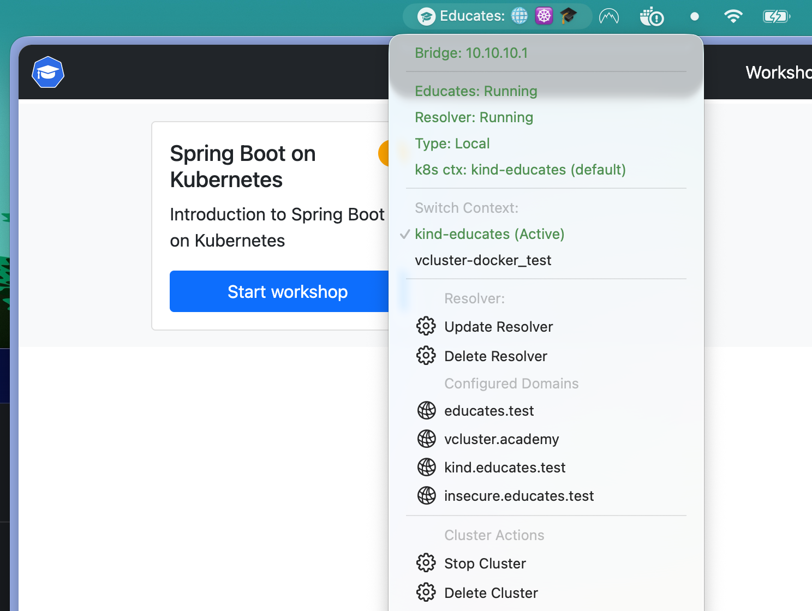

When running Educates locally on macOS, your cluster's accessibility depends on your machine's IP address. Network transitions—moving between WiFi networks, connecting to different Ethernet ports, or even system wakeup—can change your IP address, breaking DNS resolution and cluster access. While solutions exist to update DNS resolvers when IPs change, a more robust approach is to maintain a fixed IP address that persists across network changes.

This post explains why a fixed IP matters for local Educates clusters and how to achieve it using a virtual bridge interface on macOS, with automatic recreation via a LaunchDaemon that triggers on network activation—not just system startup, but also on wakeup.

<!-- truncate -->

## Why a Fixed IP Matters

Educates local clusters rely on DNS resolution to map domain names like `educates.test` to your machine's IP address. When your IP changes:

- DNS resolver configurations become stale, pointing to old IPs
- Cluster ingresses become inaccessible via their configured hostnames
- Workshop URLs break, requiring manual DNS updates
- Development workflow is disrupted

A fixed IP eliminates these issues by ensuring your cluster always resolves to the same address, regardless of which physical network interface is active or how your system's network configuration changes.

## Creating a Virtual Bridge Interface

macOS supports virtual bridge interfaces that can be configured with a static IP address. This bridge acts as a stable network endpoint that persists across network changes.

### Step 1: Create the Bridge Interface

Create a bridge interface using `ifconfig`:

```bash
sudo ifconfig bridge100 create
```

This creates a bridge interface named `bridge100`. You can verify it exists:

```bash
ifconfig bridge100
```

The output will show an interface with no IP address yet:

```
bridge100: flags=8863<UP,BROADCAST,SMART,RUNNING,SIMPLEX,MULTICAST> mtu 1500
	ether 02:42:ac:11:00:01
	inet6 fe80::42:acff:fe11:1%bridge100 prefixlen 64 scopeid 0x1a
	nd6 options=201<PERFORMNUD,DAD>
	media: autoselect
	status: active
```

### Step 2: Configure a Static IP Address

Assign a static IP address to the bridge. Choose an IP in a range that won't conflict with your common networks—`192.168.100.1` is a good default:

```bash
sudo ifconfig bridge100 192.168.100.1 netmask 255.255.255.0
```

Verify the configuration:

```bash
ifconfig bridge100
```

You should now see:

```
bridge100: flags=8863<UP,BROADCAST,SMART,RUNNING,SIMPLEX,MULTICAST> mtu 1500
	ether 02:42:ac:11:00:01
	inet 192.168.100.1 netmask 0xffffff00 broadcast 192.168.50.255
	inet6 fe80::42:acff:fe11:1%bridge100 prefixlen 64 scopeid 0x1a
	nd6 options=201<PERFORMNUD,DAD>
	media: autoselect
	status: active
```

### Step 3: Configure Educates to Use the Bridge IP

Update your Educates local configuration to use this fixed IP. First, check your current configuration:

```bash
educates local config view
```

Then edit the configuration:

```bash
educates local config edit
```

Add or update the resolver configuration to use the bridge IP:

```yaml
clusterIngress:
  domain: educates.test
resolver:
  hostIP: 192.168.100.1
```

If you haven't deployed the resolver yet, deploy it:

```bash
educates local resolver deploy
```

If the resolver is already running, update it:

```bash
educates local resolver update
```

## Automating Bridge Creation with LaunchDaemon

The bridge interface created manually will not persist across reboots or network changes. To ensure it's always available, we'll create a LaunchDaemon that recreates the bridge whenever the network becomes active—on system startup, wakeup, and network interface activation.

### Step 1: Create the Bridge Creation Script

Create a script that checks for the bridge and creates it if missing:

```bash
#!/bin/zsh
set -euo pipefail

BRIDGE_NAME="bridge100"
BRIDGE_IP="192.168.100.1"
BRIDGE_NETMASK="255.255.255.0"

# Check if bridge exists
if ! ifconfig "${BRIDGE_NAME}" >/dev/null 2>&1; then
    # Create bridge if it doesn't exist
    ifconfig "${BRIDGE_NAME}" create
fi

# Check if bridge has the correct IP
current_ip=$(ifconfig "${BRIDGE_NAME}" | grep "inet " | awk '{print $2}' || echo "")

if [[ "${current_ip}" != "${BRIDGE_IP}" ]]; then
    # Configure bridge with static IP
    ifconfig "${BRIDGE_NAME}" "${BRIDGE_IP}" netmask "${BRIDGE_NETMASK}" up
fi
```

Save this script to `/usr/local/sccripts/educates-bridge-setup.sh` and make it executable:

```bash
sudo mkdir -p /usr/local/scripts
sudo tee /usr/local/scripts/educates-bridge-setup.sh > /dev/null << 'EOF'
#!/bin/bash

# --- SELF-LOGGING START ---
LOG_FILE="/var/log/staticbridge.log"

# Check if log file is larger than 1MB (1048576 bytes) and delete it if so
if [ -f "$LOG_FILE" ] && [ $(stat -f%z "$LOG_FILE") -ge 1048576 ]; then
    rm "$LOG_FILE"
fi

# Ensure the log file is writable (in case it was created by root differently)
# If this fails, the script will continue but logs might go to system log.
touch "$LOG_FILE" 2>/dev/null

# Redirect all future output (1) and errors (2) to the log file
exec 1>>"$LOG_FILE" 2>&1
# --- SELF-LOGGING END ---

# Configuration
INTERFACE="bridge1"
IP_ADDRESS="10.10.10.1/24"

echo "--- Starting execution at $(date) ---"

# 1. Check if the bridge interface already exists
if /sbin/ifconfig "$INTERFACE" > /dev/null 2>&1; then
    echo "Interface $INTERFACE already exists."
else
    echo "Interface $INTERFACE not found. Attempting to create..."
    if /sbin/ifconfig "$INTERFACE" create; then
        echo "Successfully created $INTERFACE."
    else
        echo "ERROR: Failed to create $INTERFACE."
        exit 1
    fi
fi

# 2. Configure the IP Address
echo "Configuring IP $IP_ADDRESS on $INTERFACE..."
if /sbin/ifconfig "$INTERFACE" inet "$IP_ADDRESS"; then
    echo "IP address assigned successfully."
else
    echo "ERROR: Failed to assign IP address."
    exit 1
fi

# 3. Final Verification
CURRENT_CONFIG=$(/sbin/ifconfig "$INTERFACE")
if [[ "$CURRENT_CONFIG" == *"$IP_ADDRESS"* ]] || [[ "$CURRENT_CONFIG" == *"10.10.10.1"* ]]; then
    echo "SUCCESS: Bridge is up and IP is verified."
else
    echo "WARNING: Script finished, but IP verification failed. Check interface manually."
    exit 1
fi

exit 0
fi
EOF

sudo chmod +x /usr/local/scripts/educates-bridge-setup.sh
```

### Step 2: Create the LaunchDaemon

Create a LaunchDaemon plist file that runs the script on network activation:

```bash
sudo tee /Library/LaunchDaemons/com.educates.bridge.plist > /dev/null << 'EOF'
<?xml version="1.0" encoding="UTF-8"?>
<!DOCTYPE plist PUBLIC "-//Apple//DTD PLIST 1.0//EN" "http://www.apple.com/DTDs/PropertyList-1.0.dtd">
<plist version="1.0">
<dict>
    <key>Label</key>
    <string>com.educates.bridge</string>
    
    <key>ProgramArguments</key>
    <array>
        <string>/usr/local/scripts/educates-bridge-setup.sh</string>
    </array>
    
    <key>RunAtLoad</key>
    <true/>
    
    <key>KeepAlive</key>
    <false/>
    
    <key>StartInterval</key>
    <integer>30</integer>
    
    <key>WatchPaths</key>
    <array>
        <string>/Library/Preferences/SystemConfiguration/NetworkInterfaces.plist</string>
        <string>/Library/Preferences/SystemConfiguration/com.apple.network.identification.plist</string>
    </array>
    
    <key>StandardOutPath</key>
    <string>/var/log/educates-bridge.log</string>
    
    <key>StandardErrorPath</key>
    <string>/var/log/educates-bridge.log</string>
</dict>
</plist>
```

This LaunchDaemon configuration includes:

- **RunAtLoad**: Runs immediately when loaded
- **StartInterval**: Checks every 30 seconds to catch network changes
- **WatchPaths**: Monitors network configuration files for changes, triggering on network activation
- **KeepAlive**: Set to `false` since we're polling and watching paths

### Step 3: Load the LaunchDaemon

Load the LaunchDaemon:

```bash
sudo launchctl load /Library/LaunchDaemons/com.educates.bridge.plist
```

Verify it's running:

```bash
sudo launchctl list | grep educates
```

You should see `com.educates.bridge` in the list.

### Step 4: Test the Setup

Test that the bridge is created and persists:

```bash
# Check bridge exists
ifconfig bridge100

# Simulate network change by bringing interface down and up
sudo ifconfig bridge100 down
sleep 2
# The LaunchDaemon should recreate it within 30 seconds
sleep 35
ifconfig bridge100
```

Check the logs to verify the LaunchDaemon is working:

```bash
sudo tail -f /var/log/educates-bridge.log
```

## Verification

After setting up the bridge and LaunchDaemon, verify your Educates cluster can use the fixed IP:

```bash
# Verify bridge has correct IP
ifconfig bridge100 | grep "inet "

# Verify Educates resolver is using the bridge IP
educates local resolver status

# Test DNS resolution
dig @127.0.0.1 educates.test
```

The resolver should be configured to use `192.168.100.1` for DNS resolution, and your cluster should remain accessible even after network changes or system wakeup.

## Design Rationale

This approach uses a virtual bridge interface rather than modifying physical network interfaces because:

- **Isolation**: The bridge doesn't interfere with your primary network configuration
- **Persistence**: Virtual bridges can be recreated programmatically without affecting system network settings
- **Compatibility**: Works regardless of which physical interface is active (WiFi, Ethernet, etc.)
- **Simplicity**: No need to modify system network preferences or DHCP settings

The LaunchDaemon uses both polling (`StartInterval`) and file watching (`WatchPaths`) because macOS network change events can be inconsistent across different system versions and network types. This dual approach ensures the bridge is recreated reliably on network activation, system wakeup, and startup.

## Unloading the Service

To remove the LaunchDaemon:

```bash
sudo launchctl unload /Library/LaunchDaemons/com.educates.bridge.plist
sudo rm /Library/LaunchDaemons/com.educates.bridge.plist
sudo rm /usr/local/scripts/educates-bridge-setup.sh
```

To remove the bridge interface:

```bash
sudo ifconfig bridge100 destroy
```

## Bonus points

You can even create a [SwiftBar plugin](https://swiftbar.app/) to have some of your Educates local cluster details visible, as well as triggering some
Educates local commands. But if you want to know how, ask us, and we'll write about that.




## Conclusion

Using a virtual bridge interface with a fixed IP address provides a stable network endpoint for your Educates local cluster. Combined with a LaunchDaemon that recreates the bridge on network activation, this setup ensures your cluster remains accessible via consistent DNS resolution regardless of network changes, system wakeup, or reboots. This eliminates the need for manual DNS resolver updates and provides a more reliable local development experience.
