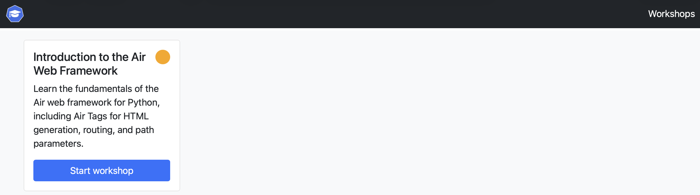
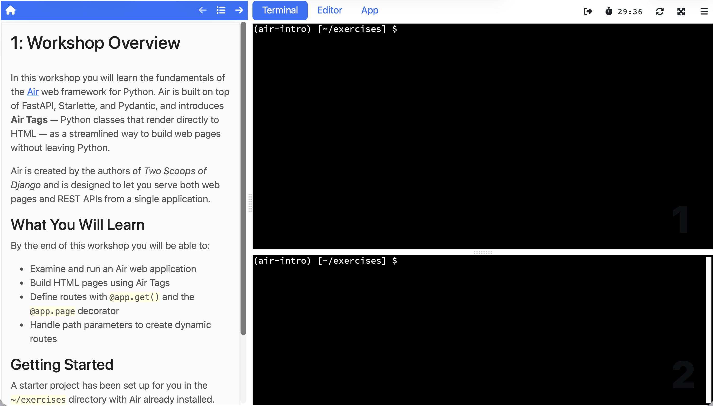

In our [last post](/blog/teaching-an-ai-about-educates/) we showed how an AI skill can generate a complete interactive workshop for the Educates training platform. The result was a working workshop for the Air Python web framework, and you can browse the source in the [GitHub repository](https://github.com/GrahamDumpleton/lab-python-air-intro). But having workshop source files sitting in a repository is only half the story. The question that naturally follows is: how do you actually deploy it?

If you've used platforms like Killercoda, Instruqt, or Strigo, the answer would be straightforward. You push your content to the platform, and it handles the rest. But that convenience comes with a trade-off that's easy to overlook until it bites you.

<!-- truncate -->

## Not another SaaS platform

The interactive workshop space has been dominated by SaaS offerings. Katacoda was one such option, but when it shut down in 2022, a lot of people lost workshops they'd invested significant time in creating. Killercoda emerged as a successor, but the fundamental dynamic is the same: you're reliant on a third party. Instruqt and Strigo are commercial services where you pay for access and have no control over how the platform evolves, what it costs next year, or whether it continues to exist at all.

[Educates](https://github.com/educates/educates-training-platform/) takes a different approach. It's open source and self-hosted. You deploy it on your own infrastructure, which means you decide where it runs, when it runs, and who has access. Whether you're running private internal training for your team or hosting public workshops at a conference, you own the platform. If you want to modify how it works, you can. If you want to run it air-gapped inside a corporate network, you can do that too. That freedom is the point.

## Deploy it where you want

Because you're deploying Educates yourself, you get to choose the infrastructure. Educates runs on Kubernetes, and that Kubernetes can live anywhere. You could use a managed cluster from a cloud provider like AWS, GCP, or Azure. You could run your own Kubernetes on virtual machines or physical hardware. Or, if you just want to try things out on your own machine, the Educates CLI can create a local Kubernetes cluster for you using [Kind](https://kind.sigs.k8s.io/) running on Docker.

That range of options means you can go from personal experimentation to production training without switching platforms. The same workshop content works regardless of where the cluster is running.

For the rest of this post we'll walk through that local option, since it's the easiest way to get started and doesn't require any cloud infrastructure.

## Creating a local Educates environment

The Educates CLI handles the setup. If you have Docker running on your machine, creating a local Educates environment is a single command:

```
educates create-cluster
```

This creates a Kind-based Kubernetes cluster and installs everything Educates needs on top of it: the platform operators that manage workshop sessions, a local container image registry, and ingress routing so you can access workshops through your browser. It takes a few minutes to complete, but once it's done you have a fully functional Educates installation running locally.

## Publishing and deploying a workshop

With the local environment running, you can publish the Air workshop from a local checkout of the GitHub repository. From the workshop directory, run:

```
educates publish-workshop
```

This builds an OCI image containing the workshop files and pushes it to the local image registry that was set up alongside the cluster. The workshop definition file (which the AI skill created as part of the workshop in our previous post) already contains everything Educates needs to know about how to deploy and configure the workshop, so there's nothing else to set up.

To deploy the workshop so it's available to use, run:

```
educates deploy-workshop
```

That's it. The workshop is now running on your local Educates installation and ready to be accessed.

## Accessing the workshop

To open the training portal in your browser, run:

```
educates browse-workshops
```

This opens the Educates training portal, which is where learners go to find and start workshops.



From the portal, you select the workshop you want to run and click to start it. Educates spins up an isolated session for you, and after a moment you're dropped into the workshop dashboard.



The dashboard is the full Educates workshop experience. On one side you have the workshop instructions with their clickable actions. On the other side is the integrated environment with a terminal and editor, plus any additional dashboard tabs the workshop has configured (in this case, a browser tab for viewing the running web application). Everything the learner needs is right there, and it's all running on your own machine.

The workshop we showed being generated in the last post works exactly as expected. You can click through the instructions, run the commands, edit the files, and see the Air web application running in the embedded browser tab. The entire guided experience functions just as it would on a production Educates installation.

## Beyond Kubernetes

Running Educates on a local Kubernetes cluster is the most straightforward way to try things out, and it gives you the complete platform experience. But Kubernetes isn't the only option for running a workshop. The same underlying container image used to run the workshop can also be run directly in Docker without any Kubernetes cluster at all. The Educates CLI supports this too.

That said, running in Docker comes with trade-offs. Some features that depend on Kubernetes won't be available, and the workshop itself may need adjustments to work correctly in a Docker environment. We'll cover that in a future post, including how the AI skill from the previous post can help figure out what needs to change.

If you want to try any of this yourself, the [Educates documentation](https://docs.educates.dev) has a more detailed quick start guide that covers installation and configuration options beyond what we've shown here.
