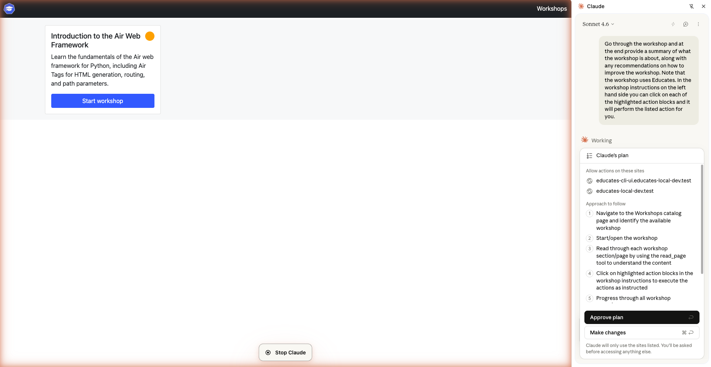
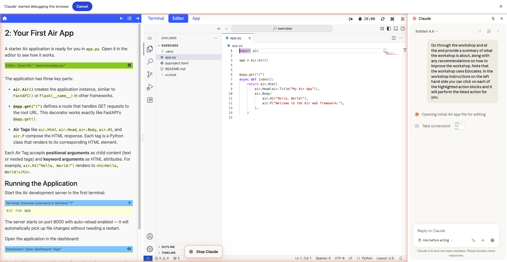
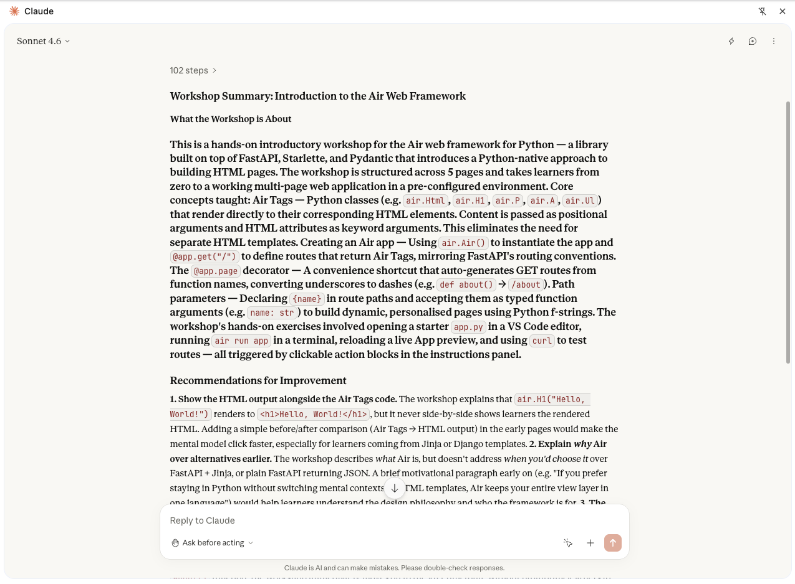

In our [previous post](/blog/deploying-educates-yourself/) we walked through deploying an AI-generated Educates workshop on a local Kubernetes cluster. The workshop was up and running, accessible through the training portal, and ready to be used. But having a workshop that runs is only the first step. The next question is whether it's actually any good.

Workshop review is traditionally a manual process. You open the workshop in a browser, click through each page, read the instructions, run the commands, check that everything works, and make notes on what could be improved. It's time-consuming and somewhat tedious, especially when you're the person who wrote the workshop in the first place and already know what it's supposed to do. Even this task, though, is one where AI can help.

<!-- truncate -->

## Reviewing the source vs the experience

One option would be to point Claude at the workshop source files directly. Hand it the Markdown content and the YAML configuration and ask it to review the material. This works to a degree, but it only checks the content in isolation. It doesn't tell you anything about how the workshop actually feels when someone uses it.

The real test of a workshop is the experience of navigating it as a learner. How do the instructions read when you're looking at them alongside a terminal and editor? Does the flow between pages make sense? Do the clickable actions appear at the right moments, and is it clear what they do? These are things you can only assess by going through the workshop the way a learner would.

So rather than having Claude review the source files, the better approach is to have it use the workshop in an actual browser.

## Claude in the browser

The Claude extension for Chrome can interact with web pages directly. It can read page content, click on elements, scroll, and navigate between pages. That makes it well suited to walking through an Educates workshop end to end.

We pointed it at the Educates training portal with the Air workshop available, and gave it a prompt asking it to go through the workshop and provide a summary along with recommendations for improvement.

The prompt needed to include some explanation of how Educates workshops work, because the browser extension doesn't appear to support Claude skills (as far as we're aware). That meant we had to tell it that the workshop has clickable action blocks in the instructions panel on the left side, and that it should click on each of those highlighted actions to execute the described tasks, just as a learner would. Without that context, Claude wouldn't know to interact with those elements.

## Navigating the workshop

Once Claude had its plan approved, it started working through the workshop. It navigated to the workshop catalog, started the workshop, and began reading through each page of instructions. It scrolled down through longer pages, clicked through to following pages, and because we'd told it about the clickable actions, it clicked on those too, triggering terminal commands and editor actions just as a human learner would.

Claude worked through the entire workshop from start to finish, experiencing it the same way someone encountering it for the first time would. It isn't as quick as if it were reviewing the raw files directly, but it's still faster than a person doing the same thing.

## The impartial reviewer

Once Claude had gone through the whole workshop, it provided its review with a summary of what the workshop covers and recommendations for how it could be improved.

What we find most valuable about this is that Claude is impartial in a way that human reviewers often aren't. We have high standards for workshops, being the team behind the Educates platform itself, and when we're reviewing workshops that others have written, if we feel the quality doesn't meet those standards, there's a social pressure not to be too blunt about it. You don't want to discourage people, so you temper your feedback. Most human reviewers do the same, holding back on the more critical observations to be polite.

Claude doesn't have that constraint. It gives you the direct feedback, which in practice means you get more useful observations. The feedback covers multiple dimensions too: the quality of the written content, the overall flow of the workshop, how clickable actions are used and whether their usage is effective or confusing. It can even surface shortcomings in the Educates platform itself, pointing out places where the clickable action mechanisms could work better, which is feedback that's genuinely useful for improving the platform and not just the workshop.

## Model selection matters

One thing we noticed is that the quality of the review can vary significantly depending on which model you use. We tried both Sonnet and Opus, and somewhat counterintuitively, Sonnet produced better review output for this particular use case. Bigger doesn't always mean better when the task is focused and specific.

The results can also vary between runs of the same model. Two reviews of the same workshop with the same model and similar prompting can surface different observations or emphasise different aspects. That's not necessarily a problem, but it does mean you should be prepared to iterate. Running the review more than once and comparing what comes back gives you a more complete picture than relying on a single pass.

## What could be better

This is a valuable tool, but there are several things that could make it better.

The most impactful would be skills support in the browser extension. Because the extension doesn't support Claude skills, we had to manually explain how Educates workshops work in the prompt. If it supported skills, we could create a dedicated workshop review skill that encapsulates all the context Claude needs: how the workshop dashboard is laid out, what the different types of clickable actions are, how navigation works, and what to look for when reviewing. That would make the prompting much simpler and the review more consistent and thorough.

The review output is also trapped in the browser extension's chat pane. It would be far more useful if Claude could save the analysis to a file, with screenshots linked to specific pieces of feedback so you can see exactly what the AI is referring to when it flags an issue. The extension does supposedly support screen recording to produce an animated GIF of the session, but we couldn't get that to work (possibly a macOS permissions issue). Even if it did work, a recording of the whole session is less useful than targeted screenshots tied to individual observations.

The new Claude remote control feature could also be interesting for this. Claude can work through a workshop faster than a person would, but because the Chrome extension pauses at each step waiting for the browser to fully update, it can still take a while when working through a large workshop, or even a course made up of multiple workshops. During that time you're just watching it work. If you could access the chat remotely, even just with snapshots of what the browser is showing rather than a live view, you could wander away from your desk while you wait and still check on it if you need to.
