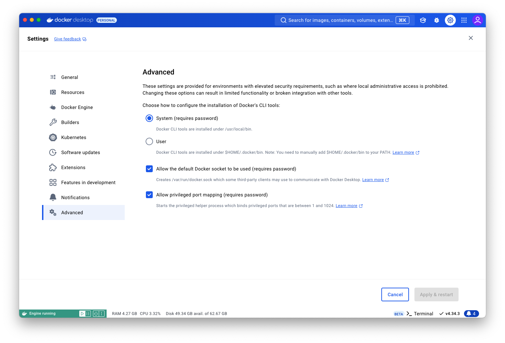

# Installing Docker Desktop

First, we are going to install Docker Desktop.
[Click here to get to the download page.](https://www.docker.com/products/docker-desktop/)

:::note[***I don't want to use Docker Desktop***]
If this is your stance, you probably already have an alternative container runtime
installed on your machine - Podman, Docker daemon, Orbstack, etc.

While these alternatives *should* work, there might be unforeseen consequences - let
me know if you run into troubles and I'll try to help.

You may also [open an issue](https://github.com/mocdaniel/educates-primer/issues/new) on
this site's GitHub project describing your problem.
:::

## Configuring Docker Desktop

As Educates will configure a KinD cluster according to our needs, there's a few things we need to adjust in
Docker Desktop, the underlying runtime:

**Open Docker Desktop**, navigate to the **Settings page** by
clicking the :octicons-gear-16: icon in the top-right corner, and make sure the **\[Advanced\] settings look like this.**



:::note[***My `Advanced` settings look different***]
If your settings page looks different or some options are missing, that's fine - things should
work out of the box then.
:::

## Testing Docker Desktop

To test if the installation and tweaking of Docker Desktop has been successful, **spin up a terminal** and
run the following command:

```sh title="Testing the Docker setup"
docker run --rm -p 80:80 hello-world
```

The output should look like this:

```{ .text .no-copy title="Output" }
docker run --rm -p 80:80 hello-world

Hello from Docker!
This message shows that your installation appears to be working correctly.

To generate this message, Docker took the following steps:
 1. The Docker client contacted the Docker daemon.
 2. The Docker daemon pulled the "hello-world" image from the Docker Hub.
    (arm64v8)
 3. The Docker daemon created a new container from that image which runs the
    executable that produces the output you are currently reading.
 4. The Docker daemon streamed that output to the Docker client, which sent it
    to your terminal.

To try something more ambitious, you can run an Ubuntu container with:
 $ docker run -it ubuntu bash

Share images, automate workflows, and more with a free Docker ID:
 https://hub.docker.com/

For more examples and ideas, visit:
 https://docs.docker.com/get-started/
```
