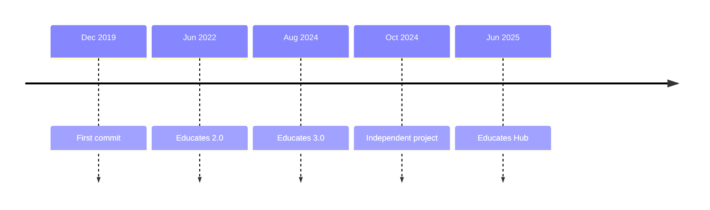

Educates began as a tool for one team: developer advocates who needed to
train people in Kubernetes and show developer tools running on it. Today it
is an independent open source project, and it teaches any topic that
benefits from a live environment.

## A tool for developer advocates

The first commit to the Educates repository dates from December 2019.
[Graham Dumpleton](https://github.com/GrahamDumpleton) and
[Jorge Morales](https://github.com/jorgemoralespou) developed it while
working at VMware, for a team of developer advocates who needed to train
people in Kubernetes and show developer tools running on it.

## Educates 2.0

Educates 2.0, released in June 2022, brought much of what defines Educates
today: installation with Carvel packages, a local Educates environment for
writing workshops, new workshop templates with GitHub actions to publish
them, Kyverno to enforce security policies, support for OpenShift, a
virtual cluster or a Git server for each Session, and an operator of its own
to copy secrets between namespaces.
The [release notes](https://docs.educates.dev/en/stable/release-notes/version-2.0.0.html)
list it all.

## Educates 3.0

Educates 3.0, released in August 2024, overhauled how the `educates` CLI
installs Educates and creates a local Kind cluster: kapp-controller was no
longer needed in the cluster, and the CLI gained opinionated installs to
cloud providers.

## An independent project

By then VMware was part of Broadcom, and in 2024 Broadcom's cuts left the
project without active maintainers. Broadcom agreed to hand Educates over
to the community, and in October 2024 it
[became an independent project](/blog/educates-independent): it moved to
its own GitHub organization, [github.com/educates](https://github.com/educates),
and educates.dev became its website.

## Educates Hub

In June 2025, [Educates Hub](/blog/announcing-educates-hub) opened at
[hub.educates.dev](https://hub.educates.dev): a catalog of workshops, and of
extension packages for them, that you deploy on your own Educates.

## Who runs Educates

Two maintainers look after the project, as its
[MAINTAINERS](https://github.com/educates/educates-training-platform/blob/develop/MAINTAINERS.md)
file lists: Graham Dumpleton and Jorge Morales.

Four organizations have added themselves to its
[ADOPTERS](https://github.com/educates/educates-training-platform/blob/develop/ADOPTERS.md)
file. Broadcom uses Educates for Spring Academy, Kube Academy and Tanzu
Academy. The other three use it for a playground and internal learning
platforms, workshops on demand for their customers, internal training, and
demo environments. If you use Educates too, adding your organization to
that file helps the project more than you might think.

To follow what comes next, watch the
[releases](https://github.com/educates/educates-training-platform/releases),
or find the community on the [Community](/community) page.
