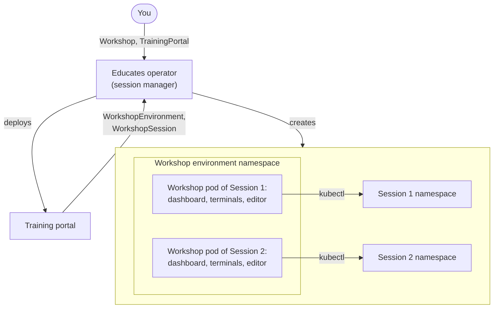
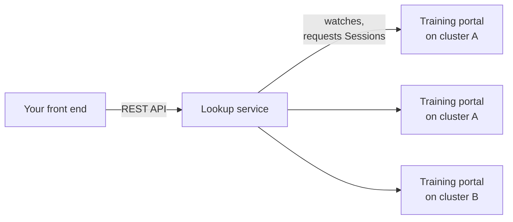

Educates hosts hands-on workshops. Every Attendee gets a Session of their
own: step-by-step instructions next to a live environment, with terminals,
an editor and whatever else the workshop needs, from a single container up
to a virtual machine. You run Educates on a Kubernetes cluster to serve
many Sessions at once, or run a single workshop on your laptop with Docker.

This page explains the parts and how they fit together. The docs' own
[platform architecture](https://docs.educates.dev/en/stable/project-details/platform-architecture.html)
page goes deeper into each one.

## Workshop content

A workshop is a set of Markdown files with the step-by-step instructions,
plus a workshop definition: a `Workshop` resource, kept in
`resources/workshop.yaml`, that says where the content lives, what
environment each Session needs, which resources to create, and what
access to grant. Hugo renders the instructions into the Session, with
layouts Educates provides.

Educates pulls the content from one of three places:

- a Git repository;
- an OCI image registry, where the content is published as an OCI
  artifact;
- a web server, as an archive it downloads.

A workshop can also bring its own container image, with the tools,
language runtimes and command line tools its Attendees need.

## The Session

When an Attendee starts a workshop, they get a Session of their own,
shown in the browser as the workshop dashboard: the instructions on the
left, and tabs on the right. The dashboard can show:

- **Instructions**, where a command can be clickable, so a click runs it in
  the right terminal, and a snippet can be copied with a click.
- **Terminals**, one or more shells in the workshop container.
- **An editor** based on VS Code.
- **The Kubernetes web console**, the Kubernetes dashboard, for workshops
  about Kubernetes.
- **Slides**, made with reveal.js or impress.js, or a PDF.
- **Custom tabs** for other web applications the workshop uses.

Behind the dashboard, each Session gets the environment its workshop asks
for, and a workshop can combine them:

- **A container**, which every Session has. Enough for a workshop about a
  programming language or a command line tool.
- **A Kubernetes namespace** of its own, with quotas and role based access
  control (RBAC), so Attendees cannot get in each other's way.
- **A virtual cluster**, with [vcluster](https://www.vcluster.com/), for
  cluster admin access without a real cluster per Attendee.
- **A virtual machine** on the cluster's nodes, with
  [KubeVirt](https://kubevirt.io/), or one on an external infrastructure
  provider, created from the Session through an operator such as
  [Crossplane](https://www.crossplane.io/).

## On Kubernetes

On a cluster, an operator manages workshops and Sessions, and you drive it
with Educates' own custom resources. You write two of them:

- **`Workshop`**, the workshop definition from the content's
  `resources/workshop.yaml`.
- **`TrainingPortal`**, which deploys a training portal serving one or more
  workshops. The portal is the website where Attendees register, or start
  anonymously, and pick a workshop, and its REST API lets a front end of
  your own do the same.

The training portal creates the other two, and you never write them
yourself:

- **`WorkshopEnvironment`**, one for each workshop in the portal, with a
  namespace for the resources its Sessions share.
- **`WorkshopSession`**, one for each Session, created ahead of time and
  kept in reserve, or created when an Attendee asks for one.

Note where each part of a Session runs. Its workshop pod, the container
behind the dashboard, runs in the workshop environment's namespace, next to
the pods of the other Sessions of that workshop. The Session's own
namespace is where the Attendee deploys their workloads. RBAC on a service
account unique to the Session keeps the Attendee to the namespaces and
resources the workshop allows.

Educates runs as a few workloads in the `educates` namespace:

- **The session manager** is the operator. It deploys a training portal
  for each `TrainingPortal`, and turns the portal's `WorkshopEnvironment`
  and `WorkshopSession` resources into namespaces, pods, ingresses and the
  access rules of each Session.
- **The secrets manager** copies secrets between namespaces and adds image
  pull secrets to service accounts, as its own resources (`SecretCopier`,
  `SecretExporter`, `SecretImporter` and `SecretInjector`) describe.
- **The lookup service**, which is optional; see below.

[What you just installed](/getting-started-guides/about), part 2 of the
Getting Started Guides, shows these on a running cluster, with the
commands to look at them.

## The lookup service

A training portal's REST API serves that one portal. Once you run several
portals, on one cluster or many, turn on the lookup service, an optional
part of Educates. It watches the training portals on every cluster you
register with it, and gives your front end one REST API: list the
workshops, ask for a Session, and the lookup service sends the request to a
portal with room for it. Tenants decide which clusters and portals each
client of the API can reach.

The [lookup service](/features/lookup-service) Feature page shows where it
fits, and the
[docs](https://docs.educates.dev/en/stable/lookup-service/service-overview.html)
cover its resources and API.

## On your laptop

You do not need a cluster to try a workshop or to write one:

- **Docker only.** A single workshop can run in one container on Docker,
  or any container runtime with a compatible API, without Kubernetes. It is
  the quick way to try a workshop or give a product demo from a laptop. The
  workshop gets no Kubernetes namespace, virtual cluster or virtual
  machine.
- **A local cluster.** For writing workshops, the Educates CLI creates a
  local Kubernetes cluster with Kind, installs Educates in it, and adds an
  image registry on your machine to publish workshops to. The
  [Getting Started Guides](/getting-started-guides/setup) set one up step
  by step.

## Where it runs

To host workshops for other people, give Educates a Kubernetes cluster of
its own. The docs strongly recommend a dedicated cluster: Attendees are not
always people you trust, and even with RBAC, security policies and quotas
in place, one of them could affect everything else the cluster runs. The
cluster needs:

- **An ingress controller** on ports 80 and 443. The docs strongly
  recommend [Contour](https://projectcontour.io/) over nginx, whose
  reloads drop websocket connections as Sessions come and go.
- **A wildcard DNS record** for the ingress domain, because every Session
  gets host names of its own, and a **wildcard certificate** for that
  domain to serve Sessions over HTTPS.
- **Persistent volumes** of type `ReadWriteOnce` from the default storage
  class.
- **[Kyverno](https://kyverno.io/)**, which enforces the security policies
  Educates provides for the cluster and for each workshop. On OpenShift,
  security context constraints enforce the cluster's policies, and Kyverno
  still enforces the workshops'.

The Educates CLI installs Educates into an existing cluster, with ready-made
settings for Amazon EKS, Google GKE, Kind, Minikube, OpenShift and vcluster,
and can install what Educates needs with it, such as Contour, Kyverno,
cert-manager and ExternalDNS. Any other cluster with an ingress controller
uses the generic settings, or a configuration you write in full. The docs'
[cluster requirements](https://docs.educates.dev/en/stable/installation-guides/cluster-requirements.html)
and
[installation instructions](https://docs.educates.dev/en/stable/installation-guides/installation-instructions.html)
take it from there.
