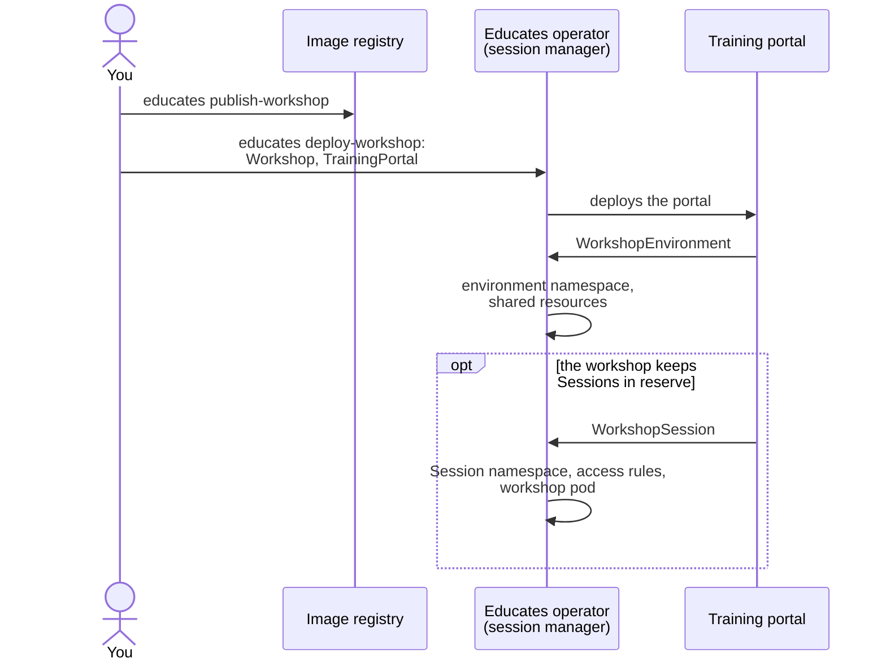
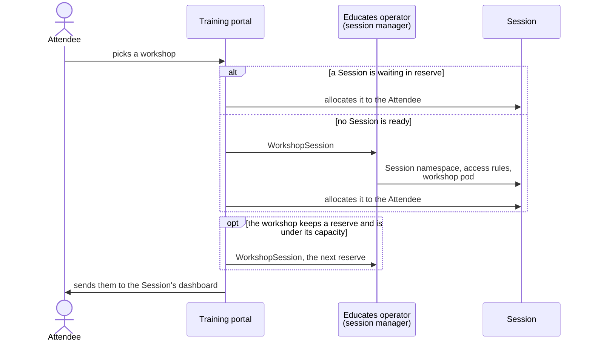
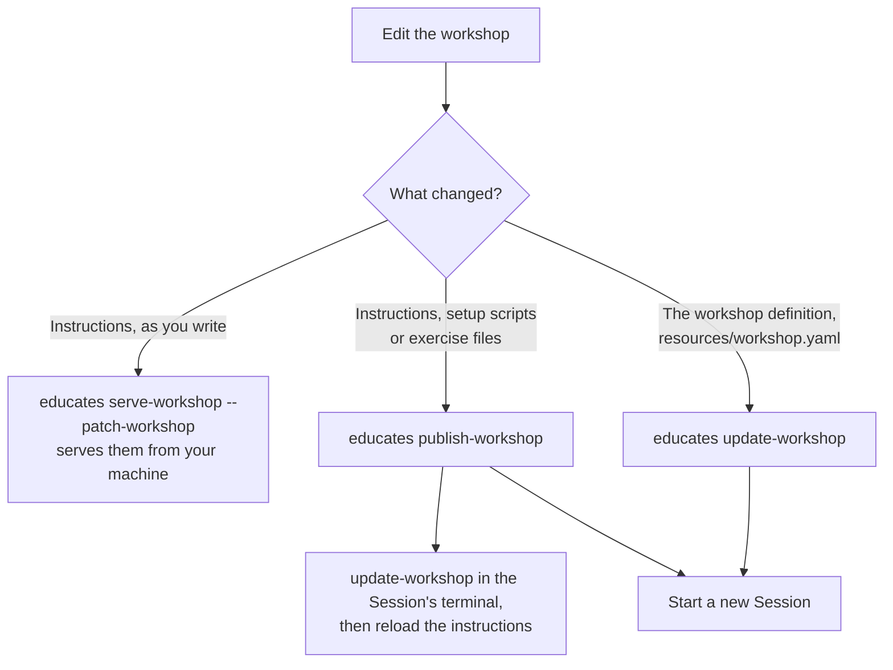

A workshop starts as a folder of Markdown and YAML on your machine, and
ends as a Session in an Attendee's browser. This page follows it through
each step on a local Educates cluster, where the Educates CLI does the
work, and says what changes when you host it for real.
[Write your first workshop](/getting-started-guides/authoring) in the
Getting Started Guides takes you through the same steps hands-on.

## From source to Session

1. **Write.** `educates new-workshop lab-my-workshop` generates a workshop
   from the template: the instructions, in Markdown, under
   `workshop/content`, and the workshop definition, a `Workshop` resource,
   in `resources/workshop.yaml`.
2. **Publish.** From the workshop's folder, `educates publish-workshop`
   packages the workshop files as an OCI image artifact and pushes it to
   the local cluster's image registry, at `localhost:5001`.
3. **Deploy.** `educates deploy-workshop` loads the workshop definition into
   the cluster and adds the workshop to a training portal, creating the
   portal if the cluster has none.
4. **Set up.** The training portal creates a `WorkshopEnvironment` for the
   workshop, and the Educates operator gives it a namespace with the
   resources all its Sessions share. If the workshop keeps Sessions in
   reserve, the portal creates them now, so the first Attendees do not
   wait.
5. **Start.** `educates browse-workshops` opens the portal, and an Attendee
   picks the workshop there.

Every arrow into the operator is a custom resource created through the
Kubernetes API, which the operator watches. The training portal, not the
operator, decides which environments and Sessions should exist; the
operator creates what they need.

Hosting workshops for others changes who does steps 2 and 3, not what
happens. The content can live in a Git repository or on a web server
instead of an image registry, and the workshop templates come with GitHub
actions to publish a workshop. An administrator then applies the `Workshop`
and `TrainingPortal` resources to the cluster, where the portal takes over
as above.

## Starting a Session

When an Attendee picks a workshop, the training portal hands them a
Session waiting in reserve if there is one, and creates one on the spot if
not. Either way the Attendee lands on the Session's dashboard. If the
workshop keeps Sessions in reserve and is under its capacity, the portal
creates another one for the next Attendee.

A Session's workshop container downloads the workshop's files and runs its
setup scripts as it starts, so a Session created in reserve is ready to use
the moment it is allocated. How many Sessions a portal keeps in reserve,
creates up front and runs at most is set per workshop, with `reserved`,
`initial` and `capacity` in the `TrainingPortal`. A training portal keeps
one Session of each workshop in reserve unless told otherwise; the one
`educates deploy-workshop` creates keeps none, unless you pass
`--reserved`, so on a local cluster each Session starts when you ask for
it.

## When a Session ends

A Session belongs to one Attendee and is never handed to another. The
`TrainingPortal` decides when it goes:

- **`expires`** deletes a Session that long after it was allocated. With a
  `deadline` as well, the Attendee can extend their time from the
  dashboard's countdown timer, up to that deadline.
- **`orphaned`** deletes a Session nobody is using: that long after its
  browser page is closed, or three times that long while the page is
  hidden.
- **`overdue`** deletes a Session whose dashboard the Attendee never
  reached in time, for example because a setup script is stuck.

With `expires` set, finishing or restarting the workshop deletes the
Session too. For a workshop that runs for a set time, such as one at a
conference, leave `orphaned` off so breaks do not cost anyone their work,
and delete the training portal at the end: its Sessions go with it. The
docs'
[TrainingPortal reference](https://docs.educates.dev/en/stable/custom-resources/training-portal.html)
covers each setting.

## Changing a workshop

How you see a change depends on what you changed. None of them needs a
container image rebuilt.

- **Content.** After `educates publish-workshop`, start a new Session to
  see the change. For a small change, run `update-workshop` in the
  terminal of the Session you have open instead: it downloads the
  content again, unpacks it into the Session and reruns the setup
  scripts. Hold Shift while you click the dashboard's reload icon to
  reload just the instructions.
- **Instructions, live.** `educates serve-workshop --patch-workshop` points
  the workshop at a web server on your machine. Start a new Session, and
  its instructions rebuild and reload in the browser each time you save. Only the
  instructions come from your machine: setup scripts and exercise files
  still need a publish and a new Session. Ctrl-C stops it and puts the
  published workshop back. The guides'
  [live editing](/getting-started-guides/authoring/live-edit) page shows
  it at work.
- **Definition.** A change to `resources/workshop.yaml` reaches the cluster
  with `educates update-workshop`, run from your machine. When the change
  affects the environment or the Sessions, the old workshop environment
  shuts down and a new one starts, so end your Session and start a new
  one.

The docs'
[Creating a Workshop](https://docs.educates.dev/en/stable/getting-started/creating-a-workshop.html)
page has the full commands.
