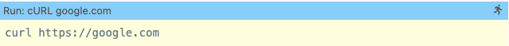
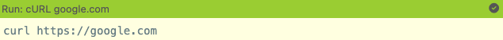
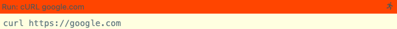

Two things are very important for great workshops:

- a **proper environment**, with basic tooling and configuration
   already installed
- **flexibility** to try out (and break) things in a **fast feedback loop**,
   while still being able to follow a **golden path** and being set
   up for success.

Educates can help with both concerns out of the box, in multiple ways -
let's see how!

## Preparing a Workshop Session

Educates provides a mechanism for ensuring a proper workshop environment,
with configuration and installation of additional tools needed for a workshop
already installed: `workshop/setup.d/`.

Educates runs every executable script in `workshop/setup.d` whose name ends
in `.sh` when the Session's container starts. The scripts run from the
workshop user's home directory, and can read a set of pre-defined
environment variables with information about the Session, such as
`SESSION_NAME`, `SESSION_NAMESPACE` and `INGRESS_DOMAIN`. The docs list them
all in
[Workshop runtime](https://docs.educates.dev/en/stable/workshop-content/workshop-runtime.html).

This way, we can do things like...

- ...generating Kubernetes manifests with session-specific information
   (e.g. Ingress Hostnames)
- ...install additional tools not included in the workshop session image
   by default
- fetch additional files or information from 3rd-party APIs

upon session start.

:::warning[Setup scripts run more than once]
Educates runs **all scripts** in `workshop/setup.d` **again** whenever the
Session's container restarts, and when you run `update-workshop` in the
Session's terminal to pull in new content.

Thus it's important to keep **idempotency** in mind when creating your
scripts: running one twice must do no harm.
:::

### Generating Manifests on Session Start

Building on the mentioned use-cases above, let's look at an example setup
script and include it in our demo-workshop. It writes an Ingress for an
application the workshop would deploy, at a host name of its own for each
Session.

1. Create the `workshop/setup.d` directory.
   ```sh title="Create the setup directory"
   mkdir -p workshop/setup.d
   ```
2. Create a new script `workshop/setup.d/write-ingress.sh` in your editor.
   ```sh title="Create the script"
   vim workshop/setup.d/write-ingress.sh
   ```
3. Copy-paste the script's content. The quoted `'EOF'` stops the shell from
   filling in the variables while it writes the template, so `envsubst` fills
   them in from the Session's environment afterwards.
   ```sh title="Contents of the script"
   #!/bin/bash

   # Create the Ingress manifest template
   cat << 'EOF' > ~/ingress.in.yaml
   apiVersion: networking.k8s.io/v1
   kind: Ingress
   metadata:
     name: app1
     namespace: ${SESSION_NAMESPACE}
   spec:
     rules:
     - host: app1-${SESSION_NAME}.${INGRESS_DOMAIN}
       http:
         paths:
         - path: /
           pathType: Prefix
           backend:
             service:
               name: app1-service
               port:
                 number: 80
   EOF

   # Generate the manifest from the template
   envsubst < ~/ingress.in.yaml > ~/ingress.yaml

   # Clean up
   rm ~/ingress.in.yaml
   ```
4. Make the script executable.
   ```sh title="Make the setup script executable"
   chmod +x workshop/setup.d/write-ingress.sh
   ```
5. Publish and redeploy the new version of the demo workshop.
   ```sh title="Redeploy the demo workshop"
   educates publish-workshop
   educates deploy-workshop
   ```
6. Start a new workshop session and take a look at `~/ingress.yaml`.

## Guiding Users with Clickable Actions

A properly setup environment goes a long way already, but what if users break
things, misconfigure their environments as they go, or get stuck otherwise?

Great workshops find ways to mitigate such situations or bring users back
on the golden path to follow throughout the workshop, and Educates includes
a few different features enabling us to do exactly that - **clickable actions**.

### How Clickable Actions Work

On the authoring side, clickable actions are equal to **annotated fenced code blocks**
with a **special syntax** depending on the **type** of clickable action.

There are different categories of clickable actions:

- `terminal`: execute or terminate commands, collect input
- `workshop`: collection of utilities, e.g. copying to the clipboard
- `dashboard`: adding, reloading, and deleting tabs to the dashboard
- `editor`: opening and searching through files in the editor
- `files`: up/download of files to/from the session
- `examiner`: automatically evaluated tests/quizzes within the session
- `section`: toggling sections to hide/show

An example of a clickable action that executes a command in the session's terminal
would look like this:

~~~md title="Clear terminal and curl google.com"
```terminal:execute
prefix: Run
title: cURL google.com
command: curl https://google.com
clear: true
```
~~~

The resulting block in the rendered instructions would look like this, clearly
color-coded depending of its state:





### Quizzing Users

Let's add a clickable action to our workshops that checks a user's basic Linux
knowledge by having them create a file with a specific content in a given directory.

`examiner` clickable actions rely on executable scripts in `workshop/examiner/tests/`
that evaluate the condition to be checked by the test/quiz. Thus, we will have
to create a short script as well as the markdown block for the clickable action.

1. Create the directory `workshop/examiner/tests`.
   ```sh title="Create workshop/examiner/tests"
   mkdir -p workshop/examiner/tests
   ```
2. Create a new file `workshop/examiner/tests/test-hello-world-file`.
3. Copy-paste the following content to the file.
   ```sh title="Create test script"
   #! /bin/sh
   [ -f ~/hello/world ] && grep "It's me!" ~/hello/world > /dev/null
   ```
4. Make the script executable.
   ```sh title="Make test script executable"
   chmod +x workshop/examiner/tests/test-hello-world-file
   ```
5. Copy-paste the following action block to the workshop instructions.
   ~~~
   ```examiner:execute-test
   title: Create a file ~/hello/world with content "It's me!"
   name: test-hello-world-file
   retries: .INF
   ```
   ~~~

In addition, we will have to **enable the `examiner` feature** for
our workshop in `resources/workshop.yaml`:

```yaml title="Enable the examiner for the workshop" {25-26}
apiVersion: training.educates.dev/v1beta1
kind: Workshop
metadata:
  name: "demo-workshop"
spec:
  title: "Workshop"
  description: "Workshop description."
  publish:
    image: "$(image_repository)/demo-workshop-files:$(workshop_version)"
  workshop:
    files:
      - image:
          url: "$(image_repository)/demo-workshop-files:$(workshop_version)"
        includePaths:
          - /workshop/**
          - /exercises/**
          - /README.md
  session:
    namespaces:
      budget: medium
    applications:
      terminal:
        enabled: true
        layout: split
      examiner:
        enabled: true
      editor:
        enabled: true
      console:
        enabled: false
      docker:
        enabled: false
      registry:
        enabled: false
      vcluster:
        enabled: false
```

Once this is done, we can **publish and deploy** the workshop again using the Educates CLI.
Afterwards, we should be able to spot the clickable examiner action in the rendered
instructions. Observe what happens when you click it before and after you create the file
as required!