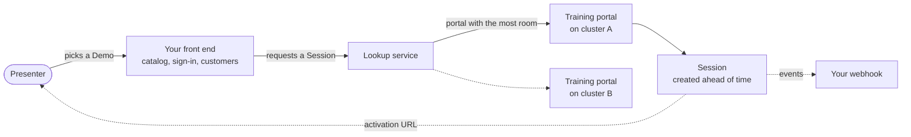

The reference architecture has four parts: your front end, the lookup
service, training portals on one or more clusters, and the Session each
Presenter gets.

1. **Your front end** lists the Demos a Presenter may run, signs them in your
   way, and knows which customer each Demo is for. It authenticates to the
   lookup service as a client with access to a tenant.
2. **The lookup service** takes each request, with the workshop, the
   Presenter's user ID, any parameters for the customer and a webhook URL,
   and sends it to the training portal with the most room among the tenant's
   clusters and portals.
3. **The training portals** run on one or more clusters, each with its own
   capacity, branding and Sessions created ahead of time.
4. **The Session** comes back as an activation URL, which the Presenter's
   browser must open within 60 seconds, in a new tab or in an iframe of your
   front end. Asking again with the same user ID returns the Session the
   Presenter already has.

The
[lookup service docs](https://docs.educates.dev/en/stable/lookup-service/service-overview.html)
cover clusters, tenants, clients and the
[request for a Session](https://docs.educates.dev/en/stable/lookup-service/workshops-api.html#requesting-a-workshop-session),
and
[Portal integration](https://docs.educates.dev/en/stable/lookup-service/portal-integration.html)
covers new tabs, iframes and sending the Presenter back when a Session ends.
